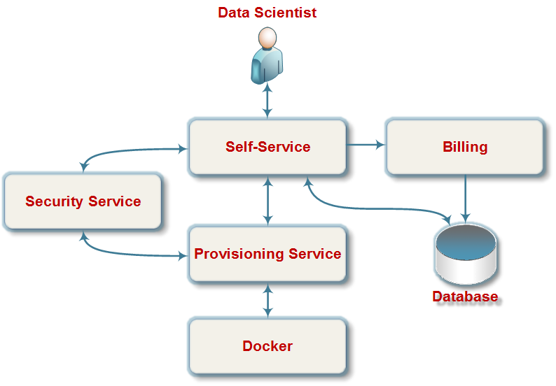
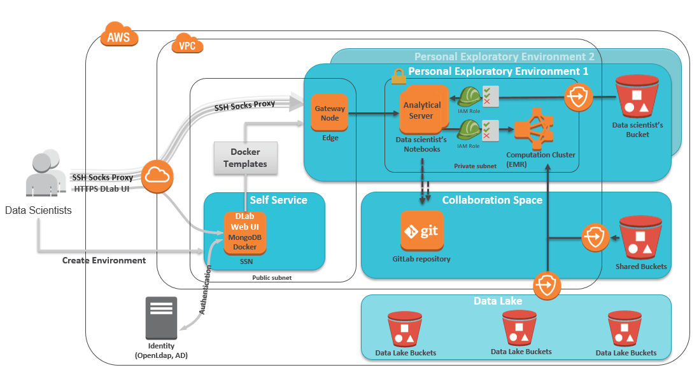
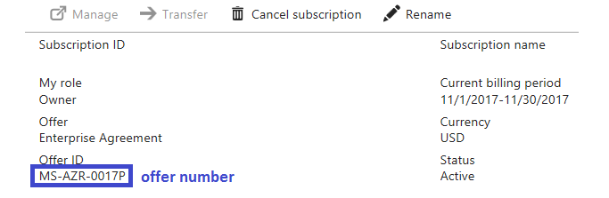

DLAB Overview
=============

-------
CONTENTS
-------

[What is DLAB?](#What_is_DLAB)

&nbsp; &nbsp; [How to Contribute](CONTRIBUTING.md)

[Logical architecture](#Logical_architecture)

[Physical architecture](#Physical_architecture)

[DLab Deployment](#DLab_Deployment)

&nbsp; &nbsp; &nbsp; &nbsp; [Structure of main DLab directory](#DLab_directory)

&nbsp; &nbsp; &nbsp; &nbsp; [Structure of log directory](#log_directory)

&nbsp; &nbsp; &nbsp; &nbsp; [Self-Service Node](#Self_Service_Node)

&nbsp; &nbsp; &nbsp; &nbsp; [Edge Node](#Edge_Node)

&nbsp; &nbsp; &nbsp; &nbsp; [Notebook node](#Notebook_node)

&nbsp; &nbsp; &nbsp; &nbsp; [EMR cluster](#EMR_cluster)

&nbsp; &nbsp; &nbsp; &nbsp; [Configuration files](#Configuration_files)

&nbsp; &nbsp; &nbsp; &nbsp; [Starting/Stopping services](#Starting_Stopping_services)

&nbsp; &nbsp; &nbsp; &nbsp; [Billing report](#Billing_Report)

&nbsp; &nbsp; &nbsp; &nbsp; [Backup and Restore](#Backup_and_Restore)

&nbsp; &nbsp; &nbsp; &nbsp; [GitLab server](#GitLab_server)

&nbsp; &nbsp; &nbsp; &nbsp; [Troubleshooting](#Troubleshooting)

[Development](#Development)

&nbsp; &nbsp; &nbsp; &nbsp; [Folder structure](#Folder_structure)

&nbsp; &nbsp; &nbsp; &nbsp; [Pre-requisites](#Pre-requisites)

&nbsp; &nbsp; &nbsp; &nbsp; [Java back-end services](#Java_back_end_services)

&nbsp; &nbsp; &nbsp; &nbsp; [Front-end](#Front_end)

&nbsp; &nbsp; &nbsp; &nbsp; [How to setup local development environment](#setup_local_environment)

&nbsp; &nbsp; &nbsp; &nbsp; [How to run locally](#run_locally)

&nbsp; &nbsp; &nbsp; &nbsp; [Infrastructure provisioning](#Infrastructure_provisioning)

&nbsp; &nbsp; &nbsp; &nbsp; [LDAP Authentication](#LDAP_Authentication)

&nbsp; &nbsp; &nbsp; &nbsp; [Azure OAuth2 Authentication](#Azure_OAuth2_Authentication)

---------------
# What is DLAB? <a name="What_is_DLAB"></a>

DLab is an essential toolset for analytics. It is a self-service Web Console, used to create and manage exploratory environments. It allows teams to spin up analytical environments with best of breed open-source tools just with a single click of the mouse. Once established, environment can be managed by an analytical team itself, leveraging simple and easy-to-use Web Interface.

----------------------------
# Logical architecture <a name="Logical_architecture"></a>

The following diagram demonstrates high-level logical architecture of DLab.



The diagram shows main components of DLab, which is a self-service for the infrastructure deployment and interaction with it. The purpose of each component is described below.

## Self-Service

Self-Service is a service, which provides RESTful user API with Web User Interface for data scientist. It tightly interacts with Provisioning Service and Database. Self-Service delegates all user\`s requests to Provisioning Service. After execution of certain request from Self-service, Provisioning Service returns response about corresponding action happened with particular resource. Self-service, then, saves this response into Database. So, each time Self-Service receives request about status of provisioned infrastructure resources – it loads it from Database and propagates to Web UI.

## Billing

Billing is a module, which provides a loading of the billing report for the environment to the database. It can be running as part of the Self-Service or a separate process.

## Provisioning Service

The Provisioning Service is a RESTful service, which provides APIs for provisioning of the user’s infrastructure. Provisioning Service receives the request from Self-Service, afterwards it forms and sends a command to the docker to execute requested action. Docker executes the command and generates a response.json file. Provisioning service analyzes response.json and responds to initial request of Self-Service, providing status-related information of the instance.

## Security service

Security Service is RESTful service, which provides authorization API for Self-Service and Provisioning Service via LDAP.

## Docker

Docker is an infrastructure-provisioning module based on Docker service, which provides low-level actions for infrastructure management.

## Database

Database serves as a storage with description of user infrastructure, user’s settings and service information.

-----------------------------
# Physical architecture <a name="Physical_architecture"></a>

The following diagram demonstrates high-level physical architecture of DLab in AWS




## Main components

-   Self-service node (SSN)
-   Edge node
-   Notebook node (Jupyter, Rstudio, etc.)
-   Data engine cluster
-   Data engine cluster as a service provided with Cloud

## Self-service node (SSN)

Creation of self-service node – is the first step for deploying DLab. SSN is a main server with following pre-installed services:

-   DLab Web UI – is Web user interface for managing/deploying all components of DLab. It is accessible by the following URL: http[s]://SSN\_Public\_IP\_or\_Public\_DNS
-   MongoDB – is a database, which contains part of DLab’s configuration, user’s exploratory environments description as well as user’s preferences.
-   Docker – used for building DLab Docker containers, which will be used for provisioning other components.
-   Jenkins – is an alternative to Web UI. It is accessible by the following link: http[s]://SSN\_Public\_IP\_or\_Public\_DNS/jenkins

Elastic(Static) IP address is assigned to an SSN Node, so you are free to stop|start it and and SSN node's IP address won’t change.

## Edge node

Setting up Edge node is the first step that user is asked to do once logged into DLab. This node is used as proxy server and SSH gateway for the user. Through Edge node users can access Notebook via HTTP and SSH. Edge Node has a Squid HTTP web proxy pre-installed.

## Notebook node

The next step is setting up a Notebook node (or a Notebook server). It is a server with pre-installed applications and libraries for data processing, data cleaning and transformations, numerical simulations, statistical modeling, machine learning, etc. Following analytical tools are currently supported in DLab and can be installed on a Notebook node:

-   Jupyter
-   RStudio
-   Zeppelin
-   TensorFlow + Jupyter
-   Deep Learning + Jupyter

Apache Spark is also installed for each of the analytical tools above.

## Data engine cluster

After deploying Notebook node, user can create one of the cluster for it:
-   Data engine - Spark standalone cluster
-   Data engine service - cloud managed cluster platform (EMR for AWS or Dataproc for GCP)
That simplifies running big data frameworks, such as Apache Hadoop and Apache Spark to process and analyze vast amounts of data. Adding cluster is not mandatory and is only needed in case additional computational resources are required for job execution.
----------------------
# DLab Deployment <a name="DLab_Deployment"></a>

## Structure of main DLab directory <a name="DLab_directory"></a>

DLab’s SSN node main directory structure is as follows:

    /opt  
     └───dlab  
         ├───conf  
         ├───sources  
         ├───template  
         ├───tmp  
         │   └───result  
         └───webapp  

-   conf – contains configuration for DLab Web UI and back-end services;
-   sources – contains all Docker/Python scripts, templates and files for provisioning;
-   template – docker’s templates;
-   tmp –temporary directory of DLab;
-   tmp/result – temporary directory for Docker’s response files;
-   webapp – contains all .jar files for DLab Web UI and back-end
    services.

## Structure of log directory <a name="log_directory"></a>

SSN node structure of log directory is as follows:

    /var
     └───opt
         └───dlab
             └───log
                 ├───dataengine
                 ├───dateengine-service
                 ├───edge
                 ├───notebook
                 └───ssn

These directories contain the log files for each template and for DLab back-end services.
-   ssn – contains logs of back-end services;
-   provisioning.log – Provisioning Service log file;
-   security.log – Security Service log file;
-   selfservice.log – Self-Service log file;
-   edge, notebook, dataengine, dataengine-service – contains logs of Python scripts.

## Self-Service Node <a name="Self_Service_Node"></a>

### Create

Deployment of DLab starts from creating Self-Service(SSN) node. DLab can be deployed in AWS, Azure and Google cloud. 
For each cloud provider, prerequisites are different.

#### In Amazon cloud

Prerequisites:
 
 - SSH key for EC2 instances. This key could be created through Amazon Console.
 - IAM user
 - AWS access key ID and secret access key
 - The following permissions should be assigned for IAM user:
```
{
	"Version": "2012-10-17",
	"Statement": [
		{
			"Action": [
				"iam:ListRoles",
				"iam:CreateRole",
				"iam:CreateInstanceProfile",
				"iam:PutRolePolicy",
				"iam:AddRoleToInstanceProfile",
				"iam:PassRole",
				"iam:GetInstanceProfile",
				"iam:ListInstanceProfilesForRole"
				"iam:RemoveRoleFromInstanceProfile",
				"iam:DeleteInstanceProfile"
			],
			"Effect": "Allow",
			"Resource": "*"
		},
		{
			"Action": [
				"ec2:DescribeImages",
				"ec2:CreateTags",
				"ec2:DescribeRouteTables",
				"ec2:CreateRouteTable",
				"ec2:AssociateRouteTable",
				"ec2:DescribeVpcEndpoints",
				"ec2:CreateVpcEndpoint",
				"ec2:ModifyVpcEndpoint",
				"ec2:DescribeInstances",
				"ec2:RunInstances",
				"ec2:DescribeAddresses",
				"ec2:AllocateAddress",
				"ec2:DescribeInstances",
				"ec2:AssociateAddress",
				"ec2:DisassociateAddress",
				"ec2:ReleaseAddress",
				"ec2:TerminateInstances"
			],
			"Effect": "Allow",
			"Resource": "*"
		},
		{
			"Action": [
				"s3:ListAllMyBuckets",
				"s3:CreateBucket",
				"s3:PutBucketTagging",
				"s3:GetBucketTagging"
			],
			"Effect": "Allow",
			"Resource": "*"
		}
	]
}
```

To build SSN node, following steps should be executed:

1.  Clone Git repository and make sure that all [pre-requisites](#Pre-requisites) are installed.
2.  Go to *dlab* directory.
3.  Execute following script:
```
/usr/bin/python infrastructure-provisioning/scripts/deploy_dlab.py --conf_service_base_name dlab_test --aws_access_key XXXXXXX --aws_secret_access_key XXXXXXXXXX --aws_region us-west-2 --conf_os_family debian --conf_cloud_provider aws --aws_vpc_id vpc-xxxxx --aws_subnet_id subnet-xxxxx --aws_security_groups_ids sg-xxxxx,sg-xxxx --key_path /root/ --conf_key_name Test --conf_tag_resource_id dlab --aws_account_id xxxxxxxx --aws_billing_bucket billing_bucket --aws_report_path /billing/directory/ --action create
```

This python script will build front-end and back-end part of DLab, create SSN docker image and run Docker container for creating SSN node.

List of parameters for SSN node deployment:

| Parameter                 | Description/Value                                                                       |
|---------------------------|-----------------------------------------------------------------------------------------|
| conf\_service\_base\_name | Any infrastructure value (should be unique if multiple SSN’s have been deployed before) |
| aws\_access\_key          | AWS user access key                                                                     |
| aws\_secret\_access\_key  | AWS user secret access key                                                              |
| aws\_region               | AWS region                                                                              |
| conf\_os\_family          | Name of the Linux distributive family, which is supported by DLab (Debian/RedHat)       |
| conf\_cloud\_provider     | Name of the cloud provider, which is supported by DLab (AWS)                            |
| aws\_vpc\_id              | ID of the Virtual Private Cloud (VPC)                                                   |
| aws\_subnet\_id           | ID of the public subnet                                                                 |
| aws\_security\_groups\_ids| One or more ID\`s of AWS Security Groups, which will be assigned to SSN node            |
| key\_path                 | Path to admin key (without key name)                                                    |
| conf\_key\_name           | Name of the uploaded SSH key file (without “.pem” extension)                            |
| conf\_tag\_resource\_id   | The name of tag for billing reports                                                     |
| aws\_account\_id          | The The ID of Amazon account                                                            |
| aws\_billing\_bucket      | The name of S3 bucket where billing reports will be placed                              |
| aws\_report\_path         | The path to billing reports directory in S3 bucket. This parameter isn't required when billing reports are placed in the root of S3 bucket. |
| action                    | In case of SSN node creation, this parameter should be set to “create”                  |

**Note:** If the following parameters are not specified, they will be created automatically:
-   aws\_vpc\_id
-   aws\_subnet\_id
-   aws\_sg\_ids

**Note:** If billing won't be using, the following parameters are not required:
-   aws\_account\_id
-   aws\_billing\_bucket
-   aws\_report\_path

After SSN node deployment following AWS resources will be created:

-   SSN EC2 instance
-   Elastic IP for SSN instance
-   IAM role and EC2 Instance Profile for SSN
-   Security Group for SSN node (if it was specified, script will attach the provided one)
-   VPC, Subnet (if they have not been specified) for SSN and EDGE nodes
-   S3 bucket – its name will be \<service\_base\_name\>-ssn-bucket. This bucket will contain necessary dependencies and configuration files for Notebook nodes (such as .jar files, YARN configuration, etc.)
-   S3 bucket for for collaboration between Dlab users. Its name will be \<service\_base\_name\>-shared-bucket

#### In Azure cloud

Prerequisites:

- IAM user with Contributor permissions.
- Service principal and JSON based auth file with clientId, clientSecret and tenantId. 

**Note:** The following permissions should be assigned to the service principal:

- Windows Azure Active Directory
- Microsoft Graph
- Windows Azure Service Management API

To build SSN node, following steps should be executed:

1.  Clone Git repository and make sure that all [pre-requisites](#Pre-requisites) are installed
2.  Go to *dlab* directory
3.  To have working billing functionality please review Billing configuration note and use proper parameters for SSN node deployment
4.  To use Data Lake Store please review Azure Data Lake usage pre-requisites note and use proper parameters for SSN node deployment
5.  Execute following deploy_dlab.py script:
```
/usr/bin/python infrastructure-provisioning/scripts/deploy_dlab.py --conf_service_base_name dlab_test --azure_region westus2 --conf_os_family debian --conf_cloud_provider azure --azure_vpc_name vpc-test --azure_subnet_name subnet-test --azure_security_group_name sg-test1,sg-test2 --key_path /root/ --conf_key_name Test --azure_auth_path /dir/file.json  --action create
```

This python script will build front-end and back-end part of DLab, create SSN docker image and run Docker container for creating SSN node.

List of parameters for SSN node deployment:

| Parameter                         | Description/Value                                                                       |
|-----------------------------------|-----------------------------------------------------------------------------------------|
| conf\_service\_base\_name         | Any infrastructure value (should be unique if multiple SSN’s have been deployed before) |
| azure\_resource\_group\_name      | Resource group name (could be the same as service base name                             |
| azure\_region                     | Azure region                                                                            |
| conf\_os\_family                  | Name of the Linux distributive family, which is supported by DLab (Debian/RedHat)       |
| conf\_cloud\_provider             | Name of the cloud provider, which is supported by DLab (Azure)                          |
| azure\_vpc\_name                  | Name of the Virtual Network (VN)                                                        |
| azure\_subnet\_name               | Name of the Azure subnet                                                                |
| azure\_security\_groups\_name     | One or more Name\`s of Azure Security Groups, which will be assigned to SSN node        |
| azure\_ssn\_instance\_size        | Instance size of SSN instance in Azure                                                  |
| key\_path                         | Path to admin key (without key name)                                                    |
| conf\_key\_name                   | Name of the uploaded SSH key file (without “.pem” extension)                            |
| azure\_auth\_path                 | Full path to auth json file                                                             |
| azure\_offer\_number              | Azure offer id number                                                                   |
| azure\_currency                   | Currency that is used for billing information(e.g. USD)                                 |
| azure\_locale                     | Locale that is used for billing information(e.g. en-US)                                 |
| azure\_region\_info               | Region info that is used for billing information(e.g. US)                               |
| azure\_datalake\_enable           | Support of Azure Data Lake (true/false)                                                 |
| azure\_oauth2\_enabled            | Defines if Azure OAuth2 authentication mechanisms is enabled(true/false)                |
| azure\_validate\_permission\_scope| Defines if DLab verifies user's permission to the configured resource(scope) during login with OAuth2 (true/false). If Data Lake is enabled default scope is Data Lake Store Account, else Resource Group, where DLab is deployed, is default scope. If user does not have any role in scope he/she is forbidden to log in
| azure\_application\_id            | Azure application ID that is used to log in users in DLab                                                     |
| azure\_ad\_group\_id              | ID of group in Active directory whose members have full access to shared folder in Azure Data Lake Store                                                                          |
| action                            | In case of SSN node creation, this parameter should be set to “create”                  |

**Note:** If the following parameters are not specified, they will be created automatically:
-   azure\_vpc\_nam
-   azure\_subnet\_name
-   azure\_security\_groups\_name

**Note:** Billing configuration:

To know azure\_offer\_number open [Azure Portal](https://portal.azure.com), go to Subscriptions and open yours, then click Overview and you should see it under Offer ID property:



Please see [RateCard API](https://msdn.microsoft.com/en-us/library/mt219004.aspx) to get more details about azure\_offer\_number,
azure\_currency, azure\_locale, azure\_region_info. These DLab deploy properties correspond to RateCard API request parameters.

**Note:** Azure Data Lake usage pre-requisites:

1. Configure application in Azure portal and grant proper permissions to it.
- Open *Azure Active Directory* tab, then *App registrations* and click *New application registration*
- Fill in ui form with the following parameters *Name* - put name of the new application, *Application type* - select Native, *Sign-on URL* put any valid url as it will be updated later
- Grant proper permissions to the application. Select the application you just created on *App registration* view, then click *Required permissions*, then *Add->Select an API-> In search field type MicrosoftAzureQueryService* and press *Select*, then check the box *Have full access to the Azure Data Lake service* and save the changes. Repeat the same actions for *Windows Azure Active Directory* API (available on *Required permissions->Add->Select an API*) and the box *Sign in and read user profile*
- Get *Application ID* from application properties  it will be used as azure_application_id for deploy_dlap.py script 
2. Usage of Data Lake resource predicts shared folder where all users can write or read any data. To manage access to this folder please create ot use existing group in Active Directory. All users from this group will have RW access to the shared folder. Put ID(in Active Directory) of the group as *azure_ad_group_id* parameter to deploy_dlab.py script
3. After execution of deploy_dlab.py script go to the application created in step 1 and change *Redirect URIs* value to the https://SSN_HOSTNAME/ where SSN_HOSTNAME - SSN node hostname 

After SSN node deployment following Azure resources will be created:

-   Resource group where all DLAb resources will be provisioned
-   SSN Virtual machine
-   Static public IP address dor SSN virtual machine
-   Network interface for SSN node
-   Security Group for SSN node (if it was specified, script will attach the provided one)
-   Virtual network and Subnet (if they have not been specified) for SSN and EDGE nodes
-   Storage account and blob container for necessary further dependencies and configuration files for Notebook nodes (such as .jar files, YARN configuration, etc.)
-   Storage account and blob container for collaboration between Dlab users
-   If support of Data Lake is enabled: Data Lake and shared directory will be created 

#### In Google cloud (GCP)

Prerequisites:

- IAM user
- Service account and JSON auth file for it. In order to get JSON auth file, Key should be created for service account through Google cloud console.
  
To build SSN node, following steps should be executed:

1.  Clone Git repository and make sure that all [pre-requisites](#Pre-requisites) are installed.
2.  Go to *dlab* directory.
3.  Execute following script:
```
/usr/bin/python infrastructure-provisioning/scripts/deploy_dlab.py --conf_service_base_name dlab --gcp_region us-west1 --gcp_zone us-west1-a --conf_os_family debian --conf_cloud_provider gcp --key_path /key/path/ --conf_key_name key_name --gcp_ssn_instance_size n1-standard-1 --gcp_project_id project_id --gcp_service_account_path /path/to/auth/file.json --action create
```

This python script will build front-end and back-end part of DLab, create SSN docker image and run Docker container for creating SSN node.

List of parameters for SSN node deployment:

| Parameter                    | Description/Value                                                                       |
|------------------------------|-----------------------------------------------------------------------------------------|
| conf\_service\_base\_name    | Any infrastructure value (should be unique if multiple SSN’s have been deployed before) |
| gcp\_region                  | GCP region                                                                              |
| gcp\_zone                    | GCP zone                                                                                |
| conf\_os\_family             | Name of the Linux distributive family, which is supported by DLab (Debian/RedHat)       |
| conf\_cloud\_provider        | Name of the cloud provider, which is supported by DLab (GCP)                            |
| gcp\_vpc\_name               | Name of the Virtual Network (VN)                                                        |
| gcp\_subnet\_name            | Name of the GCP subnet                                                                  |
| gcp\_firewall\_name          | One or more Name\`s of GCP Security Groups, which will be assigned to SSN node          |
| key\_path                    | Path to admin key (without key name)                                                    |
| conf\_key\_name              | Name of the uploaded SSH key file (without “.pem” extension)                            |
| gcp\_service\_account\_path  | Full path to auth json file                                                             |
| gcp\_ssn\_instance\_size     | Instance size of SSN instance in GCP                                                    |
| gcp\_project\_id             | ID of GCP project                                                                       |
| action                       | In case of SSN node creation, this parameter should be set to “create”                  |


**Note:** In current release, Web UI and back-end won't be working. For managing further nodes, Jenkins will be installed on SSN node. URL and credentials will be provided at the end of executing *dlab-deploy.py* script.

After SSN node deployment following GCP resources will be created:

-   SSN VM instance
-   External IP address for SSN instance
-   IAM role and Service account for SSN
-   Security Groups for SSN node (if it was specified, script will attach the provided one)
-   VPC, Subnet (if they have not been specified) for SSN and EDGE nodes
-   Bucket – its name will be \<service\_base\_name\>-ssn-bucket. This bucket will contain necessary dependencies and configuration files for Notebook nodes (such as .jar files, YARN configuration, etc.)
-   Bucket for for collaboration between Dlab users. Its name will be \<service\_base\_name\>-shared-bucket

### Terminate

Terminating SSN node will also remove all nodes and components related to it. Basically, terminating Self-service node will terminate all DLab’s infrastructure.
Example of command for terminating DLab environment:

#### In Amazon
```
/usr/bin/python infrastructure-provisioning/scripts/deploy_dlab.py --conf_service_base_name dlab-test --aws_access_key XXXXXXX --aws_secret_access_key XXXXXXXX --aws_region us-west-2 --key_path /root/ --conf_key_name Test --conf_os_family debian --conf_cloud_provider aws --action terminate
```
List of parameters for SSN node termination:

| Parameter                  | Description/Value                                                                  |
|----------------------------|------------------------------------------------------------------------------------|
| conf\_service\_base\_name  | Unique infrastructure value                                                        |
| aws\_access\_key           | AWS user access key                                                                |
| aws\_secret\_access\_key   | AWS user secret access key                                                         |
| aws\_region                | AWS region                                                                         |
| key\_path                  | Path to admin key (without key name)                                               |
| conf\_key\_name            | Name of the uploaded SSH key file (without “.pem” extension)                       |
| conf\_os\_family           | Name of the Linux distributive family, which is supported by DLab (Debian/RedHat)  |
| conf\_cloud\_provider      | Name of the cloud provider, which is supported by DLab (AWS)                       |
| action                     | terminate                                                                          |

#### In Azure
```
/usr/bin/python infrastructure-provisioning/scripts/deploy_dlab.py --conf_service_base_name dlab-test --azure_vpc_name vpc-test --azure_resource_group_name resource-group-test --azure_region westus2 --key_path /root/ --conf_key_name Test --conf_os_family debian --conf_cloud_provider azure --azure_auth_path /dir/file.json --action terminate
```
List of parameters for SSN node termination:

| Parameter                  | Description/Value                                                                  |
|----------------------------|------------------------------------------------------------------------------------|
| conf\_service\_base\_name  | Unique infrastructure value                                                        |
| azure\_region              | Azure region                                                                       |
| conf\_os\_family           | Name of the Linux distributive family, which is supported by DLab (Debian/RedHat)  |
| conf\_cloud\_provider      | Name of the cloud provider, which is supported by DLab (Azure)                     |
| azure\_vpc\_name           | Name of the Virtual Network (VN)                                                   |
| key\_path                  | Path to admin key (without key name)                                               |
| conf\_key\_name            | Name of the uploaded SSH key file (without “.pem” extension)                       |
| azure\_auth\_path          | Full path to auth json file                                                        |
| action                     | terminate                                                                          |


#### In Google cloud
```
/usr/bin/python infrastructure-provisioning/scripts/deploy_dlab.py --gcp_project_id project_id --conf_service_base_name dlab --gcp_region us-west1 --gcp_zone us-west1-a --key_path /root/ --conf_key_name key_name --conf_os_family debian --conf_cloud_provider gcp --gcp_service_account_path /path/to/auth/file.json --action terminate
```
List of parameters for SSN node termination:

| Parameter                    | Description/Value                                                                       |
|------------------------------|-----------------------------------------------------------------------------------------|
| conf\_service\_base\_name    | Any infrastructure value (should be unique if multiple SSN’s have been deployed before) |
| gcp\_region                  | GCP region                                                                              |
| gcp\_zone                    | GCP zone                                                                                |
| conf\_os\_family             | Name of the Linux distributive family, which is supported by DLab (Debian/RedHat)       |
| conf\_cloud\_provider        | Name of the cloud provider, which is supported by DLab (GCP)                            |
| key\_path                    | Path to admin key (without key name)                                                    |
| conf\_key\_name              | Name of the uploaded SSH key file (without “.pem” extension)                            |
| gcp\_service\_account\_path  | Full path to auth json file                                                             |
| gcp\_project\_id             | ID of GCP project                                                                       |
| action                       | In case of SSN node termination, this parameter should be set to “terminate”            |


## Edge Node <a name="Edge_Node"></a>

Gateway node (or an Edge node) is an instance(virtual machine) provisioned in a public subnet. It serves as an entry point for accessing user’s personal analytical environment. It is created by an end-user, whose public key will be uploaded there. Only via Edge node, DLab user can access such application resources as notebook servers and dataengine clusters. Also, Edge Node is used to setup SOCKS proxy to access notebook servers via Web UI and SSH. Elastic(Static) IP address is assigned to an Edge Node. In case Edge node instance has been removed by mistake, there is an option to re-create it and Edge node IP address won’t change.

### Create

In order to create Edge node using DLab Web UI – login and, click on the button “Upload”. Choose user’s SSH public key and after that click on the button “Create”. Edge node will be deployed and corresponding instance (virtual machine) will be started.

#### In Amazon

The following AWS resources will be created:
-   Edge EC2 instance
-   Elastic IP address for Edge EC2 instance
-   User's S3 bucket
-   Security Group for user's Edge instance
-   Security Group for all further user's Notebook instances
-   Security Groups for all further user's master nodes of data engine cluster
-   Security Groups for all further user's slave nodes of data engine cluster
-   IAM Roles and Instance Profiles for user's Edge instance
-   IAM Roles and Instance Profiles all further user's Notebook instances
-   User private subnet. All further nodes (Notebooks, EMR clusters) will be provisioned in different subnet than SSN.

List of parameters for Edge node creation:

| Parameter                  | Description/Value                                                                     |
|--------------------------------|-----------------------------------------------------------------------------------|
| conf\_resource                 | edge                                                                              |
| conf\_os\_family               | Name of the Linux distributive family, which is supported by DLAB (debian/redhat) |
| conf\_service\_base\_name      | Unique infrastructure value, specified during SSN deployment                      |
| conf\_key\_name                | Name of the uploaded SSH key file (without ".pem")                                |
| edge\_user\_name               | Name of the user                                                                  |
| aws\_vpc\_id                   | ID of AWS VPC where infrastructure is being deployed                              |
| aws\_region                    | AWS region where infrastructure was deployed                                      |
| aws\_security\_groups\_ids     | One or more id’s of the SSN instance security group                               |
| aws\_subnet\_id                | ID of the AWS public subnet where Edge will be deployed                           |
| aws\_private\_subnet\_prefix   | Prefix of the private subnet                                                      |
| conf\_tag\_resource\_id        | The name of tag for billing reports                                               |
| action                         | create                                                                            |

#### In Azure

The following Azure resources will be created:
-   Edge virtual machine
-   Static public IP address for Edge virtual machine
-   Network interface for Edge node
-   Security Group for user's Edge instance
-   Security Group for all further user's Notebook instances
-   Security Groups for all further user's master nodes of data engine cluster
-   Security Groups for all further user's slave nodes of data engine cluster
-   User's private subnet. All further nodes (Notebooks, data engine clusters) will be provisioned in different subnet than SSN.
-   User's storage account and blob container 

List of parameters for Edge node creation:

| Parameter                  | Description/Value                                                                     |
|--------------------------------|-----------------------------------------------------------------------------------|
| conf\_resource                 | edge                                                                              |
| conf\_os\_family               | Name of the Linux distributive family, which is supported by DLAB (debian/redhat) |
| conf\_service\_base\_name      | Unique infrastructure value, specified during SSN deployment                      |
| conf\_key\_name                | Name of the uploaded SSH key file (without ".pem")                                |
| edge\_user\_name               | Name of the user                                                                  |
| azure\_resource\_group\_name   | Name of the resource group where all DLAb resources are being provisioned         |
| azure\_region                  | Azure region where infrastructure was deployed                                    |
| azure\_vpc\_name               | Name of Azure Virtual network where all infrastructure is being deployed          |
| azure\_subnet\_name            | Name of the Azure public subnet where Edge will be deployed                       |
| action                         | create                                                                            |

#### In Google cloud

The following GCP resources will be created:
-   Edge VM instance
-   External static IP address for Edge VM instance
-   Security Group for user's Edge instance
-   Security Group for all further user's Notebook instances
-   Security Groups for all further user's master nodes of data engine cluster
-   Security Groups for all further user's slave nodes of data engine cluster
-   User's private subnet. All further nodes (Notebooks, data engine clusters) will be provisioned in different subnet than SSN.
-   User's bucket 

List of parameters for Edge node creation:

| Parameter                  | Description/Value                                                                     |
|--------------------------------|-----------------------------------------------------------------------------------|
| conf\_resource                 | edge                                                                              |
| conf\_os\_family               | Name of the Linux distributive family, which is supported by DLAB (debian/redhat) |
| conf\_service\_base\_name      | Unique infrastructure value, specified during SSN deployment                      |
| conf\_key\_name                | Name of the uploaded SSH key file (without ".pem")                                |
| edge\_user\_name               | Name of the user                                                                  |
| gcp\_region                    | GCP region where infrastructure was deployed                                      |
| gcp\_zone                      | GCP zone where infrastructure was deployed                                        |
| gcp\_vpc\_name                 | Name of Azure Virtual network where all infrastructure is being deployed          |
| gcp\_subnet\_name              | Name of the Azure public subnet where Edge will be deployed                       |
| gcp\_project\_id               | ID of GCP project                                                                 |
| action                         | create                                                                            |

### Start/Stop <a name=""></a>

To start/stop Edge node, click on the button which looks like a cycle on the top right corner, then click on the button which is located in “Action” field and in the drop-down menu click on the appropriate action.

#### In Amazon

List of parameters for Edge node starting/stopping:

| Parameter                 | Description/Value                                            |
|---------------------------|--------------------------------------------------------------|
| conf\_resource            | edge                                                         |
| conf\_service\_base\_name | Unique infrastructure value, specified during SSN deployment |
| edge\_user\_name          | Name of the user                                             |
| aws\_region               | AWS region where infrastructure was deployed                 |
| action                    | start/stop                                                   |

#### In Azure

List of parameters for Edge node starting:

| Parameter                    | Description/Value                                                         |
|------------------------------|---------------------------------------------------------------------------|
| conf\_resource               | edge                                                                      |
| conf\_service\_base\_name    | Unique infrastructure value, specified during SSN deployment              |
| edge\_user\_name             | Name of the user                                                          |
| azure\_resource\_group\_name | Name of the resource group where all DLAb resources are being provisioned |
| azure\_region                | Azure region where infrastructure was deployed                            |
| action                       | start                                                                     |

List of parameters for Edge node stopping:

| Parameter                    | Description/Value                                                         |
|------------------------------|---------------------------------------------------------------------------|
| conf\_resource               | edge                                                                      |
| conf\_service\_base\_name    | Unique infrastructure value, specified during SSN deployment              |
| edge\_user\_name             | Name of the user                                                          |
| azure\_resource\_group\_name | Name of the resource group where all DLAb resources are being provisioned |
| action                       | stop                                                                      |

#### In Google cloud

List of parameters for Edge node starting/stopping:

| Parameter                  | Description/Value                                                                     |
|--------------------------------|-----------------------------------------------------------------------------------|
| conf\_resource                 | edge                                                                              |
| conf\_service\_base\_name      | Unique infrastructure value, specified during SSN deployment                      |
| edge\_user\_name               | Name of the user                                                                  |
| gcp\_region                    | GCP region where infrastructure was deployed                                      |
| gcp\_zone                      | GCP zone where infrastructure was deployed                                        |
| gcp\_project\_id               | ID of GCP project                                                                 |
| action                         | start/stop                                                                        |

### Recreate <a name=""></a>

In case Edge node was damaged, or terminated manually, there is an option to re-create it.

If Edge node was removed for some reason, to re-create it, click on the status button close to logged in users’s name (top right corner of the screen).Then click on gear icon in Actions column and choose “Recreate”.

List of parameters for Edge node recreation:

#### In Amazon

| Parameter                  | Description/Value                                                                 |
|----------------------------|-----------------------------------------------------------------------------------|
| conf\_resource             | edge                                                                              |
| conf\_os\_family           | Name of the Linux distributive family, which is supported by DLAB (Debian/RedHat) |
| conf\_service\_base\_name  | Unique infrastructure value, specified during SSN deployment                      |
| conf\_key\_name            | Name of the uploaded SSH key file (without ".pem")                                |
| edge\_user\_name           | Name of the user                                                                  |
| aws\_vpc\_id               | ID of AWS VPC where infrastructure is being deployed                              |
| aws\_region                | AWS region where infrastructure was deployed                                      |
| aws\_security\_groups\_ids | ID of the SSN instance's AWS security group                                       |
| aws\_subnet\_id            | ID of the AWS public subnet where Edge was deployed                               |
| edge\_elastic\_ip          | AWS Elastic IP address which was associated to Edge node                          |
| conf\_tag\_resource\_id    | The name of tag for billing reports                                               |
| action                     | Create                                                                            |

#### In Azure

| Parameter                    | Description/Value                                                                 |
|------------------------------|-----------------------------------------------------------------------------------|
| conf\_resource               | edge                                                                              |
| conf\_os\_family             | Name of the Linux distributive family, which is supported by DLAB (Debian/RedHat) |
| conf\_service\_base\_name    | Unique infrastructure value, specified during SSN deployment                      |
| conf\_key\_name              | Name of the uploaded SSH key file (without ".pem")                                |
| edge\_user\_name             | Name of the user                                                                  |
| azure\_vpc\_name             | NAme of Azure Virtual network where all infrastructure is being deployed          |
| azure\_region                | Azure region where all infrastructure was deployed                                |
| azure\_resource\_group\_name | Name of the resource group where all DLAb resources are being provisioned         |
| azure\_subnet\_name          | Name of the Azure public subnet where Edge was deployed                           |
| action                       | Create                                                                            |

#### In Google cloud
| Parameter                  | Description/Value                                                                     |
|--------------------------------|-----------------------------------------------------------------------------------|
| conf\_resource                 | edge                                                                              |
| conf\_os\_family               | Name of the Linux distributive family, which is supported by DLAB (debian/redhat) |
| conf\_service\_base\_name      | Unique infrastructure value, specified during SSN deployment                      |
| conf\_key\_name                | Name of the uploaded SSH key file (without ".pem")                                |
| edge\_user\_name               | Name of the user                                                                  |
| gcp\_region                    | GCP region where infrastructure was deployed                                      |
| gcp\_zone                      | GCP zone where infrastructure was deployed                                        |
| gcp\_vpc\_name                 | Name of Azure Virtual network where all infrastructure is being deployed          |
| gcp\_subnet\_name              | Name of the Azure public subnet where Edge will be deployed                       |
| gcp\_project\_id               | ID of GCP project                                                                 |
| action                         | create                                                                            |

## Notebook node <a name="Notebook_node"></a>

Notebook node is an instance (virtual machine), with preinstalled analytical software, needed dependencies and with pre-configured kernels and interpreters. It is the main part of personal analytical environment, which is setup by a data scientist. It can be Created, Stopped and Terminated. To support variety of analytical needs - Notebook node can be provisioned on any of cloud supported instance shape for your particular region. From analytical software, which is already pre-installed on a notebook node, end users can access (read/write) data stored on buckets/containers.

### Create

To create Notebook node, click on the “Create new” button. Then, in drop-down menu choose template type (jupyter/rstudio/zeppelin/tensor), enter notebook name and choose instance shape. After clicking the button “Create”, notebook node will be deployed and started.

List of parameters for Notebook node creation:

#### In Amazon

| Parameter                     | Description/Value                                                                 |
|-------------------------------|-----------------------------------------------------------------------------------|
| conf\_resource                | notebook                                                                          |
| conf\_os\_family              | Name of the Linux distributive family, which is supported by DLAB (debian/redhat) |
| conf\_service\_base\_name     | Unique infrastructure value, specified during SSN deployment                      |
| conf\_key\_name               | Name of the uploaded SSH key file (without ".pem")                                |
| edge\_user\_name              | Value that previously was used when Edge being provisioned                        |
| aws\_notebook\_instance\_type | Value of the Notebook EC2 instance shape                                          |
| aws\_region                   | AWS region where infrastructure was deployed                                      |
| aws\_security\_groups\_ids    | ID of the SSN instance's security group                                           |
| application                   | Type of the notebook template (jupyter/rstudio/zeppelin/tensor/deeplearning)      |
| conf\_tag\_resource\_id       | The name of tag for billing reports                                               |
| git\_creds                    | User git credentials in JSON format                                               |
| action                        | Create                                                                            |

**Note:** For format of git_creds see "Manage git credentials" lower.

#### In Azure

| Parameter                       | Description/Value                                                                 |
|---------------------------------|-----------------------------------------------------------------------------------|
| conf\_resource                  | notebook                                                                          |
| conf\_os\_family                | Name of the Linux distributive family, which is supported by DLAB (debian/redhat) |
| conf\_service\_base\_name       | Unique infrastructure value, specified during SSN deployment                      |
| conf\_key\_name                 | Name of the uploaded SSH key file (without ".pem")                                |
| edge\_user\_name                | Value that previously was used when Edge being provisioned                        |
| azure\_notebook\_instance\_size | Value of the Notebook virtual machine shape                                       |
| azure\_region                   | Azure region where infrastructure was deployed                                    |
| azure\_vpc\_name                | NAme of Azure Virtual network where all infrastructure is being deployed          |
| azure\_resource\_group\_name    | Name of the resource group where all DLAb resources are being provisioned         |
| application                     | Type of the notebook template (jupyter/rstudio/zeppelin/tensor/deeplearning)      |
| git\_creds                      | User git credentials in JSON format                                               |
| action                          | Create                                                                            |

#### In Google cloud

| Parameter                     | Description/Value                                                                 |
|-------------------------------|-----------------------------------------------------------------------------------|
| conf\_resource                | notebook                                                                          |
| conf\_os\_family              | Name of the Linux distributive family, which is supported by DLAB (debian/redhat) |
| conf\_service\_base\_name     | Unique infrastructure value, specified during SSN deployment                      |
| conf\_key\_name               | Name of the uploaded SSH key file (without ".pem")                                |
| edge\_user\_name              | Value that previously was used when Edge being provisioned                        |
| gcp\_vpc\_name                | Name of Azure Virtual network where all infrastructure is being deployed          |
| gcp\_project\_id              | ID of GCP project                                                                 |
| gcp\_notebook\_instance\_size | Value of the Notebook VM instance size                                            |
| gcp\_region                   | GCP region where infrastructure was deployed                                      |
| gcp\_zone                     | GCP zone where infrastructure was deployed                                        |
| application                   | Type of the notebook template (jupyter/rstudio/zeppelin/tensor/deeplearning)      |
| git\_creds                    | User git credentials in JSON format                                               |
| action                        | Create                                                                            |

### Stop

In order to stop Notebook node, click on the “gear” button in Actions column. From the drop-down menu click on “Stop” action.

List of parameters for Notebook node stopping:

#### In Amazon

| Parameter                 | Description/Value                                            |
|---------------------------|--------------------------------------------------------------|
| conf\_resource            | notebook                                                     |
| conf\_service\_base\_name | Unique infrastructure value, specified during SSN deployment |
| conf\_key\_name           | Name of the uploaded SSH key file (without ".pem")           |
| edge\_user\_name          | Value that previously was used when Edge being provisioned   |
| notebook\_instance\_name  | Name of the Notebook instance to terminate                   |
| aws\_region               | AWS region where infrastructure was deployed                 |
| action                    | Stop                                                         |

#### In Azure

| Parameter                       | Description/Value                                                                 |
|---------------------------------|-----------------------------------------------------------------------------------|
| conf\_resource                  | notebook                                                                          |
| conf\_service\_base\_name       | Unique infrastructure value, specified during SSN deployment                      |
| conf\_key\_name                 | Name of the uploaded SSH key file (without ".pem")                                |
| edge\_user\_name                | Value that previously was used when Edge being provisioned                        |
| notebook\_instance\_name        | Name of the Notebook instance to terminate                                        |
| azure\_resource\_group\_name    | Name of the resource group where all DLAb resources are being provisioned         |
| action                          | Stop                                                                              |

#### In Google cloud

| Parameter                 | Description/Value                                            |
|---------------------------|--------------------------------------------------------------|
| conf\_resource            | notebook                                                     |
| conf\_service\_base\_name | Unique infrastructure value, specified during SSN deployment |
| conf\_key\_name           | Name of the uploaded SSH key file (without ".pem")           |
| edge\_user\_name          | Value that previously was used when Edge being provisioned   |
| notebook\_instance\_name  | Name of the Notebook instance to terminate                   |
| gcp\_region               | GCP region where infrastructure was deployed                 |
| gcp\_zone                 | GCP zone where infrastructure was deployed                   |
| gcp\_project\_id          | ID of GCP project                                            |
| action                    | Stop                                                         |

### Start

In order to start Notebook node, click on the button, which looks like gear in “Action” field. Then in drop-down menu choose “Start” action.

List of parameters for Notebook node start:

#### In Amazon

| Parameter                 | Description/Value                                            |
|---------------------------|--------------------------------------------------------------|
| conf\_resource            | notebook                                                     |
| conf\_service\_base\_name | Unique infrastructure value, specified during SSN deployment |
| conf\_key\_name           | Name of the uploaded SSH key file (without ".pem")           |
| edge\_user\_name          | Value that previously was used when Edge being provisioned   |
| notebook\_instance\_name  | Name of the Notebook instance to terminate                   |
| aws\_region               | AWS region where infrastructure was deployed                 |
| git\_creds                | User git credentials in JSON format                          |
| action                    | start                                                        |

**Note:** For format of git_creds see "Manage git credentials" lower.

#### In Azure

| Parameter                       | Description/Value                                                                 |
|---------------------------------|-----------------------------------------------------------------------------------|
| conf\_resource                  | notebook                                                                          |
| conf\_service\_base\_name       | Unique infrastructure value, specified during SSN deployment                      |
| conf\_key\_name                 | Name of the uploaded SSH key file (without ".pem")                                |
| edge\_user\_name                | Value that previously was used when Edge being provisioned                        |
| notebook\_instance\_name        | Name of the Notebook instance to terminate                                        |
| azure\_resource\_group\_name    | Name of the resource group where all DLAb resources are being provisioned         |
| azure\_region                   | Azure region where infrastructure was deployed                                    |
| git\_creds                      | User git credentials in JSON format                                               |
| action                          | start                                                                             |

#### In Google cloud

| Parameter                 | Description/Value                                            |
|---------------------------|--------------------------------------------------------------|
| conf\_resource            | notebook                                                     |
| conf\_service\_base\_name | Unique infrastructure value, specified during SSN deployment |
| conf\_key\_name           | Name of the uploaded SSH key file (without ".pem")           |
| edge\_user\_name          | Value that previously was used when Edge being provisioned   |
| notebook\_instance\_name  | Name of the Notebook instance to terminate                   |
| gcp\_region               | GCP region where infrastructure was deployed                 |
| gcp\_zone                 | GCP zone where infrastructure was deployed                   |
| gcp\_project\_id          | ID of GCP project                                            |
| git\_creds                | User git credentials in JSON format                          |
| action                    | Stop                                                         |

### Terminate

In order to terminate Notebook node, click on the button, which looks like gear in “Action” field. Then in drop-down menu choose “Terminate” action.

List of parameters for Notebook node termination:

#### In Amazon

| Parameter                 | Description/Value                                            |
|---------------------------|--------------------------------------------------------------|
| conf\_resource            | notebook                                                     |
| conf\_service\_base\_name | Unique infrastructure value, specified during SSN deployment |
| conf\_key\_name           | Name of the uploaded SSH key file (without ".pem")           |
| edge\_user\_name          | Value that previously was used when Edge being provisioned   |
| notebook\_instance\_name  | Name of the Notebook instance to terminate                   |
| aws\_region               | AWS region where infrastructure was deployed                 |
| action                    | terminate                                                         |

**Note:** If terminate action is called, all connected data engine clusters will be removed.

#### In Azure

| Parameter                       | Description/Value                                                                 |
|---------------------------------|-----------------------------------------------------------------------------------|
| conf\_resource                  | notebook                                                                          |
| conf\_service\_base\_name       | Unique infrastructure value, specified during SSN deployment                      |
| edge\_user\_name                | Value that previously was used when Edge being provisioned                        |
| notebook\_instance\_name        | Name of the Notebook instance to terminate                                        |
| azure\_resource\_group\_name    | Name of the resource group where all DLAb resources are being provisioned         |
| action                          | terminate                                                                         |

#### In Google cloud

| Parameter                 | Description/Value                                            |
|---------------------------|--------------------------------------------------------------|
| conf\_resource            | notebook                                                     |
| conf\_service\_base\_name | Unique infrastructure value, specified during SSN deployment |
| edge\_user\_name          | Value that previously was used when Edge being provisioned   |
| notebook\_instance\_name  | Name of the Notebook instance to terminate                   |
| gcp\_region               | GCP region where infrastructure was deployed                 |
| gcp\_zone                 | GCP zone where infrastructure was deployed                   |
| gcp\_project\_id          | ID of GCP project                                            |
| git\_creds                | User git credentials in JSON format                          |
| action                    | Stop                                                         |

### List/Install additional libraries

In order to list available libraries (OS/Python2/Python3/R/Others) on Notebook node, click on the button, which looks like gear in “Action” field. Then in drop-down menu choose “Manage libraries” action.

#### In Amazon

List of parameters for Notebook node to **get list** of available libraries:

| Parameter                     | Description/Value                                                                 |
|-------------------------------|-----------------------------------------------------------------------------------|
| conf\_resource                | notebook                                                                          |
| conf\_service\_base\_name     | Unique infrastructure value, specified during SSN deployment                      |
| conf\_key\_name               | Name of the uploaded SSH key file (without ".pem")                                |
| edge\_user\_name              | Value that previously was used when Edge being provisioned                        |
| notebook\_instance\_name      | Name of the Notebook instance to terminate                                        |
| aws\_region                   | AWS region where infrastructure was deployed                                      |
| application                   | Type of the notebook template (jupyter/rstudio/zeppelin/tensor/deeplearning)      |
| action                        | lib_list                                                                          |

**Note:** This operation will return a file with response **[edge_user_name]\_[application]\_[request_id]\_all\_pkgs.json**

**Example** of available libraries in response (type->library->version):

```
{
  "os_pkg": {"htop": "2.0.1-1ubuntu1", "python-mysqldb": "1.3.7-1build2"},
  "pip2": {"requests": "N/A", "configparser": "N/A"},
  "pip3": {"configparser": "N/A"},
  "r_pkg": {"rmarkdown": "1.5"},
  "others": {"Keras": "N/A"} 
}
```


List of parameters for Notebook node to **install** additional libraries:

| Parameter                     | Description/Value                                                                    |
|-------------------------------|--------------------------------------------------------------------------------------|
| conf\_resource                | notebook                                                                             |
| conf\_service\_base\_name     | Unique infrastructure value, specified during SSN deployment                         |
| conf\_key\_name               | Name of the uploaded SSH key file (without ".pem")                                   |
| edge\_user\_name              | Value that previously was used when Edge being provisioned                           |
| notebook\_instance\_name      | Name of the Notebook instance to terminate                                           |
| aws\_region                   | AWS region where infrastructure was deployed                                         |
| application                   | Type of the notebook template (jupyter/rstudio/zeppelin/tensor/deeplearning)         |
| libs                          | List of additional libraries in JSON format with type (os_pkg/pip2/pip3/r_pkg/others)|
| action                        | lib_install                                                                          |

**Example** of additional_libs parameter:

```
{
  ...
  "libs": [
    {"group": "os_pkg", "name": "nmap"},
    {"group": "os_pkg", "name": "htop"},
    {"group": "pip2", "name": "requests"},
    {"group": "pip3", "name": "configparser"},
    {"group": "r_pkg", "name": "rmarkdown"},
    {"group": "others", "name": "Keras"}
  ]
  ...
}
```

#### In Azure

List of parameters for Notebook node to **get list** of available libraries:

| Parameter                     | Description/Value                                                                 |
|-------------------------------|-----------------------------------------------------------------------------------|
| conf\_resource                | notebook                                                                          |
| conf\_service\_base\_name     | Unique infrastructure value, specified during SSN deployment                      |
| conf\_key\_name               | Name of the uploaded SSH key file (without ".pem")                                |
| edge\_user\_name              | Value that previously was used when Edge being provisioned                        |
| notebook\_instance\_name      | Name of the Notebook instance to terminate                                        |
| azure\_resource\_group\_name  | Name of the resource group where all DLAb resources are being provisioned         |
| application                   | Type of the notebook template (jupyter/rstudio/zeppelin/tensor/deeplearning)      |
| action                        | lib_list                                                                          |

List of parameters for Notebook node to **install** additional libraries:

| Parameter                     | Description/Value                                                                    |
|-------------------------------|--------------------------------------------------------------------------------------|
| conf\_resource                | notebook                                                                             |
| conf\_service\_base\_name     | Unique infrastructure value, specified during SSN deployment                         |
| conf\_key\_name               | Name of the uploaded SSH key file (without ".pem")                                   |
| edge\_user\_name              | Value that previously was used when Edge being provisioned                           |
| notebook\_instance\_name      | Name of the Notebook instance to terminate                                           |
| azure\_resource\_group\_name  | Name of the resource group where all DLAb resources are being provisioned            |
| application                   | Type of the notebook template (jupyter/rstudio/zeppelin/tensor/deeplearning)         |
| libs                          | List of additional libraries in JSON format with type (os_pkg/pip2/pip3/r_pkg/others)|
| action                        | lib_install                                                                          |


#### In Google cloud

List of parameters for Notebook node to **get list** of available libraries:

| Parameter                     | Description/Value                                                                 |
|-------------------------------|-----------------------------------------------------------------------------------|
| conf\_resource                | notebook                                                                          |
| conf\_service\_base\_name     | Unique infrastructure value, specified during SSN deployment                      |
| conf\_key\_name               | Name of the uploaded SSH key file (without ".pem")                                |
| edge\_user\_name              | Value that previously was used when Edge being provisioned                        |
| notebook\_instance\_name      | Name of the Notebook instance to terminate                                        |
| application                   | Type of the notebook template (jupyter/rstudio/zeppelin/tensor/deeplearning)      |
| gcp\_project\_id              | ID of GCP project                                                                 |
| gcp\_zone                     | GCP zone name                                                                     |
| action                        | lib_list                                                                          |

List of parameters for Notebook node to **install** additional libraries:

| Parameter                     | Description/Value                                                                    |
|-------------------------------|--------------------------------------------------------------------------------------|
| conf\_resource                | notebook                                                                             |
| conf\_service\_base\_name     | Unique infrastructure value, specified during SSN deployment                         |
| conf\_key\_name               | Name of the uploaded SSH key file (without ".pem")                                   |
| edge\_user\_name              | Value that previously was used when Edge being provisioned                           |
| notebook\_instance\_name      | Name of the Notebook instance to terminate                                           |
| gcp\_project\_id              | ID of GCP project                                                                    |
| gcp\_zone                     | GCP zone name                                                                        |
| application                   | Type of the notebook template (jupyter/rstudio/zeppelin/tensor/deeplearning)         |
| libs                          | List of additional libraries in JSON format with type (os_pkg/pip2/pip3/r_pkg/others)|
| action                        | lib_install                                                                          |

### Manage git credentials

In order to manage git credentials on Notebook node, click on the button “Git credentials”. Then in menu you can add or edit existing credentials.

#### In Amazon

List of parameters for Notebook node to **manage git credentials**:

| Parameter                     | Description/Value                                                                 |
|-------------------------------|-----------------------------------------------------------------------------------|
| conf\_resource                | notebook                                                                          |
| conf\_service\_base\_name     | Unique infrastructure value, specified during SSN deployment                      |
| conf\_key\_name               | Name of the uploaded SSH key file (without ".pem")                                |
| edge\_user\_name              | Value that previously was used when Edge being provisioned                        |
| notebook\_instance\_name      | Name of the Notebook instance to terminate                                        |
| aws\_region                   | AWS region where infrastructure was deployed                                      |
| git\_creds                    | User git credentials in JSON format                                               |
| action                        | git\_creds                                                                        |

**Example** of git_creds parameter:

```
[{
  "username": "Test User",
  "email": "test@example.com",
  "hostname": "github.com",
  "login": "testlogin",
  "password": "testpassword"
}, ...]
```

**Note:** Fields "username" and "email" are used for commits (displays Author in git log).

**Note:** Leave "hostname" field empty to apply login/password by default for all services.

**Note:** Also your can use "Personal access tokens" against passwords.

#### In Azure

| Parameter                     | Description/Value                                                                 |
|-------------------------------|-----------------------------------------------------------------------------------|
| conf\_resource                | notebook                                                                          |
| conf\_service\_base\_name     | Unique infrastructure value, specified during SSN deployment                      |
| conf\_key\_name               | Name of the uploaded SSH key file (without ".pem")                                |
| edge\_user\_name              | Value that previously was used when Edge being provisioned                        |
| notebook\_instance\_name      | Name of the Notebook instance to terminate                                        |
| azure\_resource\_group\_name  | Name of the resource group where all DLAb resources are being provisioned         |
| git\_creds                    | User git credentials in JSON format                                               |
| action                        | git\_creds                                                                        |

#### In Google cloud

| Parameter                     | Description/Value                                                                 |
|-------------------------------|-----------------------------------------------------------------------------------|
| conf\_resource                | notebook                                                                          |
| conf\_service\_base\_name     | Unique infrastructure value, specified during SSN deployment                      |
| conf\_key\_name               | Name of the uploaded SSH key file (without ".pem")                                |
| edge\_user\_name              | Value that previously was used when Edge being provisioned                        |
| gcp\_project\_id              | ID of GCP project                                                                 |
| gcp\_region                   | GCP region name                                                                   |
| gcp\_zone                     | GCP zone name                                                                     |
| notebook\_instance\_name      | Name of the Notebook instance to terminate                                        |
| git\_creds                    | User git credentials in JSON format                                               |
| action                        | git\_creds                                                                        |

## Dataengine-service cluster <a name="Dataengine-service cluster"></a>

Dataengine-service is a cluster provided by cloud as a service (EMR on AWS) can be created if more computational resources are needed for executing analytical algorithms and models, triggered from analytical tools. Jobs execution will be scaled to a cluster mode increasing the performance and decreasing execution time.

### Create

To create dataengine-service cluster click on the “gear” button in Actions column, and click on “Add computational resources”. Specify dataengine-service version, fill in dataengine-service name, specify number of instances and instance shapes. Click on the “Create” button.

List of parameters for dataengine-service cluster creation:

#### In Amazon

| Parameter                   | Description/Value                                                        |
|-----------------------------|--------------------------------------------------------------------------|
| conf\_resource              | dataengine-service                                                       |
| conf\_service\_base\_name   | Unique infrastructure value, specified during SSN deployment             |
| conf\_key\_name             | Name of the uploaded SSH key file (without ".pem")                       |
| emr\_timeout                | Value of timeout for dataengine-service during build.                    |
| emr\_instance\_count        | Amount of instance in dataengine-service cluster                         |
| emr\_master\_instance\_type | Value for dataengine-service EC2 master instance shape                   |
| emr\_slave\_instance\_type  | Value for dataengine-service EC2 slave instances shapes                  |
| emr\_version                | Available versions of dataengine-service (emr-5.2.0/emr-5.3.1/emr-5.6.0) |
| notebook\_instance\_name    | Name of the Notebook dataengine-service will be linked to                |
| edge\_user\_name            | Value that previously was used when Edge being provisioned               |
| aws\_region                 | AWS region where infrastructure was deployed                             |
| conf\_tag\_resource\_id     | The name of tag for billing reports                                      |
| action                      | create                                                                   |

**Note:** If “Spot instances” is enabled, dataengine-service Slave nodes will be created as EC2 Spot instances.

#### In Google cloud

| Parameter                       | Description/Value                                                        |
|---------------------------------|--------------------------------------------------------------------------|
| conf\_resource                  | dataengine-service                                                       |
| conf\_service\_base\_name       | Unique infrastructure value, specified during SSN deployment             |
| conf\_key\_name                 | Name of the uploaded SSH key file (without ".pem")                       |
| notebook\_instance\_name        | Name of the Notebook dataengine-service will be linked to                |
| edge\_user\_name                | Value that previously was used when Edge being provisioned               |
| gcp\_subnet\_name               | Name of subnet                                                           |
| dataproc\_version               | Version of Dataproc                                                      |
| dataproc\_master\_count         | Number of master nodes                                                   |
| dataproc\_slave\_count          | Number of slave nodes                                                    |
| dataproc\_preemptible\_count    | Number of preemptible nodes                                              |
| dataproc\_master\_instance\_type| Size of master node                                                      |
| dataproc\_slave\_instance\_type | Size of slave node                                                       |
| gcp\_project\_id                | ID of GCP project                                                        |
| gcp\_region                     | GCP region where infrastructure was deployed                             |
| gcp\_zone                       | GCP zone name                                                            |
| conf\_tag\_resource\_id         | The name of tag for billing reports                                      |
| action                          | create                                                                   |

### Terminate

In order to terminate dataengine-service cluster, click on “x” button which is located in “Computational resources” field.

List of parameters for dataengine-service cluster termination:

#### In Amazon

| Parameter                 | Description/Value                                                   |
|---------------------------|---------------------------------------------------------------------|
| conf\_resource            | dataengine-service                                                  |
| conf\_service\_base\_name | Unique infrastructure value, specified during SSN deployment        |
| conf\_key\_name           | Name of the uploaded SSH key file (without ".pem")                  |
| edge\_user\_name          | Value that previously was used when Edge being provisioned          |
| emr\_cluster\_name        | Name of the dataengine-service to terminate                         |
| notebook\_instance\_name  | Name of the Notebook instance which dataengine-service is linked to |
| aws\_region               | AWS region where infrastructure was deployed                        |
| action                    | Terminate                                                           |

#### In Google cloud

| Parameter                 | Description/Value                                                   |
|---------------------------|---------------------------------------------------------------------|
| conf\_resource            | dataengine-service                                                  |
| conf\_service\_base\_name | Unique infrastructure value, specified during SSN deployment        |
| conf\_key\_name           | Name of the uploaded SSH key file (without ".pem")                  |
| edge\_user\_name          | Value that previously was used when Edge being provisioned          |
| notebook\_instance\_name  | Name of the Notebook instance which dataengine-service is linked to |
| gcp\_project\_id          | ID of GCP project                                                   |
| gcp\_region               | GCP region where infrastructure was deployed                        |
| gcp\_zone                 | GCP zone name                                                       |
| dataproc\_cluster\_name   | Dataproc cluster name                                               |
| action                    | Terminate                                                           |

### List/Install additional libraries

In order to list available libraries (OS/Python2/Python3/R/Others) on Dataengine-service, click on the button, which looks like gear in “Action” field. Then in drop-down menu choose “Manage libraries” action.

#### In Amazon

List of parameters for Dataengine-service node to **get list** of available libraries:

| Parameter                     | Description/Value                                                                 |
|-------------------------------|-----------------------------------------------------------------------------------|
| conf\_resource                | dataengine-service                                                                |
| conf\_key\_name               | Name of the uploaded SSH key file (without ".pem")                                |
| computational\_id             | Name of Dataengine-service                                                        |
| edge\_user\_name              | Value that previously was used when Edge being provisioned                        |
| aws\_region                   | AWS region where infrastructure was deployed                                      |
| application                   | Type of the notebook template (jupyter/rstudio/zeppelin/tensor/deeplearning)      |
| action                        | lib_list                                                                          |

**Note:** This operation will return a file with response **[edge_user_name]\_[application]\_[request_id]\_all\_pkgs.json**

**Example** of available libraries in response (type->library->version):

```
{
  "os_pkg": {"htop": "2.0.1-1ubuntu1", "python-mysqldb": "1.3.7-1build2"},
  "pip2": {"requests": "N/A", "configparser": "N/A"},
  "pip3": {"configparser": "N/A"},
  "r_pkg": {"rmarkdown": "1.5"},
  "others": {"Keras": "N/A"} 
}
```


List of parameters for Dataengine-service to **install** additional libraries:

| Parameter                     | Description/Value                                                                    |
|-------------------------------|--------------------------------------------------------------------------------------|
| conf\_resource                | dataengine-service                                                                   |
| conf\_key\_name               | Name of the uploaded SSH key file (without ".pem")                                   |
| edge\_user\_name              | Value that previously was used when Edge being provisioned                           |
| computational\_id             | Name of Dataengine-service                                                           |
| aws\_region                   | AWS region where infrastructure was deployed                                         |
| application                   | Type of the notebook template (jupyter/rstudio/zeppelin/tensor/deeplearning)         |
| libs                          | List of additional libraries in JSON format with type (os_pkg/pip2/pip3/r_pkg/others)|
| action                        | lib_install                                                                          |

**Example** of additional_libs parameter:

```
{
  ...
  "libs": [
    {"group": "os_pkg", "name": "nmap"},
    {"group": "os_pkg", "name": "htop"},
    {"group": "pip2", "name": "requests"},
    {"group": "pip3", "name": "configparser"},
    {"group": "r_pkg", "name": "rmarkdown"},
    {"group": "others", "name": "Keras"}
  ]
  ...
}
```

#### In Google cloud

List of parameters for Dataengine-service node to **get list** of available libraries:

| Parameter                     | Description/Value                                                                 |
|-------------------------------|-----------------------------------------------------------------------------------|
| conf\_resource                | dataengine-service                                                                |
| conf\_key\_name               | Name of the uploaded SSH key file (without ".pem")                                |
| edge\_user\_name              | Value that previously was used when Edge being provisioned                        |
| application                   | Type of the notebook template (jupyter/rstudio/zeppelin/tensor/deeplearning)      |
| gcp\_project\_id              | ID of GCP project                                                                 |
| gcp\_region                   | GCP region name                                                                   |
| gcp\_zone                     | GCP zone name                                                                     |
| action                        | lib_list                                                                          |

List of parameters for Dataengine-service node to **install** additional libraries:

| Parameter                     | Description/Value                                                                 |
|-------------------------------|-----------------------------------------------------------------------------------|
| conf\_resource                | dataengine-service                                                                |
| conf\_key\_name               | Name of the uploaded SSH key file (without ".pem")                                |
| edge\_user\_name              | Value that previously was used when Edge being provisioned                        |
| application                   | Type of the notebook template (jupyter/rstudio/zeppelin/tensor/deeplearning)      |
| gcp\_project\_id              | ID of GCP project                                                                 |
| gcp\_region                   | GCP region name                                                                   |
| gcp\_zone                     | GCP zone name                                                                     |
| action                        | lib_install                                                                       |


## Dataengine cluster <a name="Dataengine cluster"></a>

Dataengine is cluster based on Standalone Spark framework can be created if more computational resources are needed for executing analytical algorithms, but without additional expenses for cloud provided service.

### Create

To create Spark standalone cluster click on the “gear” button in Actions column, and click on “Add computational resources”. Specify dataengine version, fill in dataengine name, specify number of instances and instance shapes. Click on the “Create” button.

List of parameters for dataengine cluster creation:

#### In Amazon

| Parameter                      | Description/Value                                                                 |
|--------------------------------|-----------------------------------------------------------------------------------|
| conf\_resource                 | dataengine                                                                        |
| conf\_service\_base\_name      | Unique infrastructure value, specified during SSN deployment                      |
| conf\_key\_name                | Name of the uploaded SSH key file (without ".pem")                                |
| conf\_os\_family               | Name of the Linux distributive family, which is supported by DLab (Debian/RedHat) |
| notebook\_instance\_name       | Name of the Notebook dataengine will be linked to                                 |
| dataengine\_instance\_count    | Number of nodes in cluster                                                        |
| edge\_user\_name               | Value that previously was used when Edge being provisioned                        |
| aws\_region                    | Amazon region where all infrastructure was deployed                               |
| aws\_dataengine\_master\_size  | Size of master node                                                               |
| aws\_dataengine\_slave\_size   | Size of slave node                                                                |
| action                         | create                                                                            |

#### In Azure

| Parameter                      | Description/Value                                                                 |
|--------------------------------|-----------------------------------------------------------------------------------|
| conf\_resource                 | dataengine                                                                        |
| conf\_service\_base\_name      | Unique infrastructure value, specified during SSN deployment                      |
| conf\_key\_name                | Name of the uploaded SSH key file (without ".pem")                                |
| conf\_os\_family               | Name of the Linux distributive family, which is supported by DLab (Debian/RedHat) |
| notebook\_instance\_name       | Name of the Notebook dataengine will be linked to                                 |
| dataengine\_instance\_count    | Number of nodes in cluster                                                        |
| edge\_user\_name               | Value that previously was used when Edge being provisioned                        |
| azure\_vpc\_name               | Name of Azure Virtual network where all infrastructure is being deployed          |
| azure\_region                  | Azure region where all infrastructure was deployed                                |
| azure\_dataengine\_master\_size| Size of master node                                                               |
| azure\_dataengine\_slave\_size | Size of slave node                                                                |
| azure\_resource\_group\_name   | Name of the resource group where all DLAb resources are being provisioned         |
| azure\_subnet\_name            | Name of the Azure public subnet where Edge was deployed                           |
| action                         | create                                                                            |

#### In Google cloud

| Parameter                    | Description/Value                                                                 |
|------------------------------|-----------------------------------------------------------------------------------|
| conf\_resource               | dataengine                                                                        |
| conf\_service\_base\_name    | Unique infrastructure value, specified during SSN deployment                      |
| conf\_key\_name              | Name of the uploaded SSH key file (without ".pem")                                |
| conf\_os\_family             | Name of the Linux distributive family, which is supported by DLab (Debian/RedHat) |
| notebook\_instance\_name     | Name of the Notebook dataengine will be linked to                                 |
| gcp\_vpc\_name               | GCP VPC name                                                                      |
| gcp\_subnet\_name            | GCP subnet name                                                                   |
| dataengine\_instance\_count  | Number of nodes in cluster                                                        |
| gcp\_dataengine\_master\_size| Size of master node                                                               |
| gcp\_dataengine\_slave\_size | Size of slave node                                                                |
| gcp\_project\_id             | ID of GCP project                                                                 |
| gcp\_region                  | GCP region where infrastructure was deployed                                      |
| gcp\_zone                    | GCP zone name                                                                     |
| edge\_user\_name             | Value that previously was used when Edge being provisioned                        |
| action                       | create                                                                            |


### Terminate

In order to terminate dataengine cluster, click on “x” button which is located in “Computational resources” field.

List of parameters for dataengine cluster termination:

#### In Amazon

| Parameter                    | Description/Value                                                        |
|------------------------------|--------------------------------------------------------------------------|
| conf\_resource               | dataengine                                                               |
| conf\_service\_base\_name    | Unique infrastructure value, specified during SSN deployment             |
| conf\_key\_name              | Name of the uploaded SSH key file (without ".pem")                       |
| edge\_user\_name             | Value that previously was used when Edge being provisioned               |
| notebook\_instance\_name     | Name of the Notebook instance which dataengine is linked to              |
| computational\_name          | Name of cluster                                                          |
| aws\_region                  | AWS region where infrastructure was deployed                             |
| action                       | Terminate                                                                |

#### In Azure

| Parameter                    | Description/Value                                                        |
|------------------------------|--------------------------------------------------------------------------|
| conf\_resource               | dataengine                                                               |
| conf\_service\_base\_name    | Unique infrastructure value, specified during SSN deployment             |
| conf\_key\_name              | Name of the uploaded SSH key file (without ".pem")                       |
| edge\_user\_name             | Value that previously was used when Edge being provisioned               |
| computational\_name          | Name of cluster                                                          |
| notebook\_instance\_name     | Name of the Notebook instance which dataengine is linked to              |
| azure\_region                | Azure region where infrastructure was deployed                           |
| azure\_resource\_group\_name | Name of the resource group where all DLAb resources are being provisioned|
| action                       | Terminate                                                                |

#### In Google cloud

| Parameter                    | Description/Value                                                        |
|------------------------------|--------------------------------------------------------------------------|
| conf\_resource               | dataengine                                                               |
| conf\_service\_base\_name    | Unique infrastructure value, specified during SSN deployment             |
| conf\_key\_name              | Name of the uploaded SSH key file (without ".pem")                       |
| edge\_user\_name             | Value that previously was used when Edge being provisioned               |
| notebook\_instance\_name     | Name of the Notebook instance which dataengine is linked to              |
| computational\_name          | Name of cluster                                                          |
| gcp\_project\_id             | ID of GCP project                                                        |
| gcp\_region                  | GCP region where infrastructure was deployed                             |
| gcp\_zone                    | GCP zone name                                                            |
| action                       | Terminate                                                                |

### List/Install additional libraries

In order to list available libraries (OS/Python2/Python3/R/Others) on Dataengine, click on the button, which looks like gear in “Action” field. Then in drop-down menu choose “Manage libraries” action.

#### In Amazon

List of parameters for Dataengine node to **get list** of available libraries:

| Parameter                     | Description/Value                                                                 |
|-------------------------------|-----------------------------------------------------------------------------------|
| conf\_resource                | dataengine                                                                        |
| conf\_service\_base\_name     | Unique infrastructure value, specified during SSN deployment                      |
| conf\_key\_name               | Name of the uploaded SSH key file (without ".pem")                                |
| edge\_user\_name              | Value that previously was used when Edge being provisioned                        |
| computational\_id             | Name of cluster                                                                   |
| application                   | Type of the notebook template (jupyter/rstudio/zeppelin/tensor/deeplearning)      |
| action                        | lib_list                                                                          |

**Note:** This operation will return a file with response **[edge_user_name]\_[application]\_[request_id]\_all\_pkgs.json**

**Example** of available libraries in response (type->library->version):

```
{
  "os_pkg": {"htop": "2.0.1-1ubuntu1", "python-mysqldb": "1.3.7-1build2"},
  "pip2": {"requests": "N/A", "configparser": "N/A"},
  "pip3": {"configparser": "N/A"},
  "r_pkg": {"rmarkdown": "1.5"},
  "others": {"Keras": "N/A"} 
}
```


List of parameters for Dataengine node to **install** additional libraries:

| Parameter                     | Description/Value                                                                 |
|-------------------------------|-----------------------------------------------------------------------------------|
| conf\_resource                | dataengine                                                                        |
| conf\_service\_base\_name     | Unique infrastructure value, specified during SSN deployment                      |
| conf\_key\_name               | Name of the uploaded SSH key file (without ".pem")                                |
| edge\_user\_name              | Value that previously was used when Edge being provisioned                        |
| computational\_id             | Name of cluster                                                                   |
| application                   | Type of the notebook template (jupyter/rstudio/zeppelin/tensor/deeplearning)      |
| action                        | lib_install                                                                       |

**Example** of additional_libs parameter:

```
{
  ...
  "libs": [
    {"group": "os_pkg", "name": "nmap"},
    {"group": "os_pkg", "name": "htop"},
    {"group": "pip2", "name": "requests"},
    {"group": "pip3", "name": "configparser"},
    {"group": "r_pkg", "name": "rmarkdown"},
    {"group": "others", "name": "Keras"}
  ]
  ...
}
```

#### In Azure

List of parameters for Dataengine node to **get list** of available libraries:

| Parameter                     | Description/Value                                                                 |
|-------------------------------|-----------------------------------------------------------------------------------|
| conf\_resource                | dataengine                                                                        |
| conf\_service\_base\_name     | Unique infrastructure value, specified during SSN deployment                      |
| conf\_key\_name               | Name of the uploaded SSH key file (without ".pem")                                |
| edge\_user\_name              | Value that previously was used when Edge being provisioned                        |
| azure\_resource\_group\_name  | Name of the resource group where all DLAb resources are being provisioned         |
| computational\_id             | Name of cluster                                                                   |
| application                   | Type of the notebook template (jupyter/rstudio/zeppelin/tensor/deeplearning)      |
| action                        | lib_list                                                                          |

List of parameters for Dataengine node to **install** additional libraries:

| Parameter                     | Description/Value                                                                 |
|-------------------------------|-----------------------------------------------------------------------------------|
| conf\_resource                | dataengine                                                                        |
| conf\_service\_base\_name     | Unique infrastructure value, specified during SSN deployment                      |
| conf\_key\_name               | Name of the uploaded SSH key file (without ".pem")                                |
| edge\_user\_name              | Value that previously was used when Edge being provisioned                        |
| azure\_resource\_group\_name  | Name of the resource group where all DLAb resources are being provisioned         |
| computational\_id             | Name of cluster                                                                   |
| application                   | Type of the notebook template (jupyter/rstudio/zeppelin/tensor/deeplearning)      |
| action                        | lib_install                                                                       |


#### In Google cloud

List of parameters for Dataengine node to **get list** of available libraries:

| Parameter                     | Description/Value                                                                 |
|-------------------------------|-----------------------------------------------------------------------------------|
| conf\_resource                | dataengine                                                                        |
| conf\_service\_base\_name     | Unique infrastructure value, specified during SSN deployment                      |
| conf\_key\_name               | Name of the uploaded SSH key file (without ".pem")                                |
| edge\_user\_name              | Value that previously was used when Edge being provisioned                        |
| application                   | Type of the notebook template (jupyter/rstudio/zeppelin/tensor/deeplearning)      |
| gcp\_project\_id              | ID of GCP project                                                                 |
| gcp\_zone                     | GCP zone name                                                                     |
| computational\_id             | Name of cluster                                                                   |
| action                        | lib_list                                                                          |

List of parameters for Dataengine node to **install** additional libraries:

| Parameter                     | Description/Value                                                                 |
|-------------------------------|-----------------------------------------------------------------------------------|
| conf\_resource                | dataengine                                                                        |
| conf\_service\_base\_name     | Unique infrastructure value, specified during SSN deployment                      |
| conf\_key\_name               | Name of the uploaded SSH key file (without ".pem")                                |
| edge\_user\_name              | Value that previously was used when Edge being provisioned                        |
| application                   | Type of the notebook template (jupyter/rstudio/zeppelin/tensor/deeplearning)      |
| gcp\_project\_id              | ID of GCP project                                                                 |
| gcp\_zone                     | GCP zone name                                                                     |
| computational\_id             | Name of cluster                                                                   |
| action                        | lib_install                                                                       |


## Configuration files <a name="Configuration_files"></a>

DLab configuration files are located on SSN node by following path:
-   /opt/dlab/conf ssn.yml – basic configuration for all java services;
-   provisioning.yml – Provisioning Service configuration file;for
-   security.yml – Security Service configuration file;
-   self-service.yml – Self-Service configuration file.

## Starting/Stopping services <a name="Starting_Stopping_services"></a>

All DLab services running as OS services and have next syntax for
starting and stopping:
```
sudo supervisorctl {start | stop | status} [all | provserv | secserv | ui]
```
-   start – starting service or services;
-   stop – stopping service or services;
-   status – show status of service or services;
-   all – execute command for all services, this option is default;
-   provserv – execute command for Provisioning Service;
-   secserv – execute command for Security Service;
-   ui – execute command for Self-Service.

## DLab Web UI <a name="DLab Web UI"></a>

DLab self service is listening to the secure 8443 port. This port is used for secure local communication with provisioning service.

There is also Nginx proxy server running on Self-Service node, which proxies remote connection to local 8443 port.
Nginx server is listening to both 80 and 443 ports by default. It means that you could access self-service Web UI using non-secure connections (80 port) or secure (443 port).

Establishing connection using 443 port you should take into account that DLab uses self-signed certificate from the box, however you are free to switch Nginx to use your own domain-verified certificate.

To disable non-secure connection please do the following:
-   uncomment at /etc/nginx/conf.d/nginx_proxy.conf file rule that rewrites all requests from 80 to 443 port;
-   reload/restart Nginx web server.

To use your own certificate please do the following:
-   upload your certificate and key to Self-Service node;
-   specify at /etc/nginx/conf.d/nginx_proxy.conf file the correct path to your new ssl_certificate and ssl_certificate_key;
-   reload/restart Nginx web server.

## Billing report <a name="Billing_Report"></a>

### AWS

Billing module is implemented as a separate jar file and can be running in the follow modes:

-   part of Self-Service;
-   separate system process;
-   manual loading or use external scheduler;

The billing  module is running as part of the Self-Service (if billing was switched ON before SSN deployment). For details please refer to section [Self-Service Node](#Self_Service_Node). Otherwise, you should manually configure file billing.yml. See the descriptions how to do this in the configuration file. Please also note, that you should also add an entry in the Mongo database into collection:
```
{
    "_id": "conf_tag_resource_id",
    "Value": "<CONF_TAG_RESOURCE_ID>"
}
```
After you have configured the billing, you can run it as a process of Self-Service. To do this, in the configuration file self-service.yml set the property **BillingSchedulerEnabled** to **true** and restart the Self-Service:
```
sudo supervisorctl stop ui
sudo supervisorctl start ui
```
If you want to load report manually, or use external scheduler use following command:
```
java -jar /opt/dlab/webapp/lib/billing/billing-aws.x.y.jar --conf /opt/dlab/conf/billing.yml
or
java -cp /opt/dlab/webapp/lib/billing/billing-aws.x.y.jar com.epam.dlab.BillingTool --conf /opt/dlab/conf/billing.yml
```
If you want billing to work as a separate process from the Self-Service use following command:
```
java -cp /opt/dlab/webapp/lib/billing/billing-aws.x.y.jar com.epam.dlab.BillingScheduler --conf /opt/dlab/conf/billing.yml
```

### Azure

Billing module is implemented as a separate jar file and can be running in the follow modes:

-   part of Self-Service;
-   separate system process;

If you want to start billing module as a separate process use the following command:
```
java -jar /opt/dlab/webapp/lib/billing/billing-azure.x.y.jar /opt/dlab/conf/billing.yml
```

## Backup and Restore <a name="Backup_and_Restore"></a>

All DLab configuration files, keys, certificates, jars, database and logs can be saved to backup file.

Scripts for backup and restore is located in ```dlab_path/tmp/```. Default: ```/opt/dlab/tmp/```

List of parameters for run backup:

| Parameter      | Description/Value                                                                                                       |
|----------------|-------------------------------------------------------------------------------------------------------------------------|
| --dlab\_path   | Path to DLab. Default: /opt/dlab/                                                                                       |
| --configs      | Comma separated names of config files, like "security.yml", etc. Default: all                                           |
| --keys         | Comma separated names of keys, like "user_name.pub". Default: all                                                       |
| --certs        | Comma separated names of SSL certificates and keys, like "dlab-selfsigned.crt", etc. Also available: skip. Default: all |
| --jars         | Comma separated names of jar application, like "self-service" (without .jar), etc. Also available: all. Default: skip   |
| --db           | Mongo DB. Key without arguments. Default: disable                                                                       |
| --logs         | All logs (include docker). Key without arguments. Default: disable                                                      |

List of parameters for run restore:

| Parameter      | Description/Value                                                                                                       |
|----------------|-------------------------------------------------------------------------------------------------------------------------|
| --dlab\_path   | Path to DLab. Default: /opt/dlab/                                                                                       |
| --configs      | Comma separated names of config files, like "security.yml", etc. Default: all                                           |
| --keys         | Comma separated names of keys, like "user_name.pub". Default: all                                                       |
| --certs        | Comma separated names of SSL certificates and keys, like "dlab-selfsigned.crt", etc. Also available: skip. Default: all |
| --jars         | Comma separated names of jar application, like "self-service" (without .jar), etc. Also available: all. Default: skip   |
| --db           | Mongo DB. Key without arguments. Default: disable                                                                       |
| --file         | Full or relative path to backup file or folder. Required field                                                          |
| --force        | Force mode. Without any questions. Key without arguments. Default: disable                                              |

**Note:** You can type ```-h``` or ```--help``` for usage details.

**Note:** Restore process required stopping services.

## GitLab server <a name="GitLab_server"></a>

Own GitLab server can be deployed from SSN node with script, which located in:

```dlab_path/tmp/gitlab```. Default: ```/opt/dlab/tmp/gitlab```

All initial configuration parameters located in ```gitlab.ini``` file.

Some of parameters are already setuped from SSN provisioning.

GitLab uses the same LDAP server as DLab.

To deploy Gitlab server, set all needed parameters in ```gitlab.ini``` and run script:

```./gitlab_deploy.py --action [create/terminate]```

**Note:** Terminate process uses ```node_name``` to find instance.

**Note:** GitLab wouldn't be terminated with all environment termination process. 

## Troubleshooting <a name="Troubleshooting"></a>

If the parameter dlab\_path of configuration file dlab.ini wasn’t changed, the path to DLab service would default to:

-   /opt/dlab/ - main directory of DLab service
-   /var/opt/dlab/log/ or /var/log/dlab/ - path to log files

To check logs of Docker containers run the following commands:
```
docker ps -a – to get list of containers which were executed.
...
a85d0d3c27aa docker.dlab-dataengine:latest "/root/entrypoint...." 2 hours ago Exited (0) 2 hours ago infallible_gallileo
6bc2afeb888e docker.dlab-jupyter:latest "/root/entrypoint...." 2 hours ago Exited (0) 2 hours ago practical_cori
51b71c5d4aa3 docker.dlab-zeppelin:latest "/root/entrypoint...." 2 hours ago Exited (0) 2 hours ago determined_knuth
...
docker logs <container_id> – to get log for particular Docker container.
```
To change Docker images on existing environment, execute following steps:

1.  SSH to SSN instance
2.  go to */opt/dlab/sources/*
3.  Modify needed files
[4]. [ONLY FOR AZURE] Copy service principal json file with credentials to base/azure_auth.json
5.  Rebuild proper Docker images, using one or several commands (depending on what files you’ve changed):
```
docker build --build-arg OS=<os_family> --file general/files/<cloud_provider>/base_Dockerfile -t docker.dlab-base .
docker build --build-arg OS=<os_family> --file general/files/<cloud_provider>/edge_Dockerfile -t docker.dlab-edge .
docker build --build-arg OS=<os_family> --file general/files/<cloud_provider>/jupyter_Dockerfile -t docker.dlab-jupyter .
docker build --build-arg OS=<os_family> --file general/files/<cloud_provider>/rstudio_Dockerfile -t docker.dlab-rstudio .
docker build --build-arg OS=<os_family> --file general/files/<cloud_provider>/zeppelin_Dockerfile -t docker.dlab-zeppelin .
docker build --build-arg OS=<os_family> --file general/files/<cloud_provider>/tensor_Dockerfile -t docker.dlab-tensor .
docker build --build-arg OS=<os_family> --file general/files/<cloud_provider>/deeplearning_Dockerfile -t docker.dlab-deeplearning .
docker build --build-arg OS=<os_family> --file general/files/<cloud_provider>/dataengine_Dockerfile -t docker.dlab-dataengine .
```

----------------
# Development <a name="Development"></a>

DLab services could be ran in development mode. This mode emulates real work an does not create any resources on cloud provider environment.

## Folder structure <a name="Folder_structure"></a>

    dlab
    ├───infrastructure-provisioning
    └───services
        ├───billing
        ├───common
        ├───provisioning-service
        ├───security-service
        ├───self-service
        └───settings

-   infrastructure-provisioning – code of infrastructure-provisioning module;
-   services – back-end services source code;
    -   billing – billing module for AWS cloud provider only;
    -   common – reusable code for all services;
    -   provisioning-service – Provisioning Service;
    -   security-service – Security Service;
    -   self-service – Self-Service and UI;
    -   settings – global settings that are stored in mongo database in development mode;

## Pre-requisites <a name="Pre-requisites"></a>

In order to start development of Front-end Web UI part of DLab - Git repository should be cloned and the following packages should be installed:

-   Git 1.7 or higher
-   Maven 3.3 or higher
-   Python 2.7
-   Mongo DB 3.0 or higher
-   Docker 1.12 - Infrastructure provisioning
-   Java Development Kit 8 – Back-end
-   Node.js 6.x & 7.x - WebUI
-   Angular CLI v1.0.0-rc.1 or higher - WebUI
-   TypeScript v2.0 or higher - WebUI
-   Angular2 v2.4 – WebUI
-   Development IDE (Eclipse or Intellij IDEA)

## Java back-end services <a name="Java_back_end_services"></a>

### Java components description

#### Common

Common is a module, which wraps set of reusable code over services. Commonly reused functionality is as follows:

1.  Models
2.  REST client
3.  Mongo persistence DAO
4.  Security models and DAO

#### Self-Service

Self-Service provides REST based API’s. It tightly interacts with Provisioning Service and Security Service and actually delegates most of user\`s requests for execution.

| API class name                  | Supported actions                                     | Description            |
|---------------------------------|-------------------------------------------------------|------------------------|
| BillingResource                 | Get billing invoice<br>Export billing invoice in CSV file  | Provides billing information. |
| ComputationalResource           | Configuration limits<br>Create<br>Terminate           | Used for computational resources management. |
| EdgeResource                    | Start<br>Stop<br>Status                               | Manage EDGE node.      |
| ExploratoryResource             | Create<br>Status<br>Start<br>Stop<br>Terminate        | Used for exploratory environment management. |
| GitCredsResource                | Update credentials<br>Get credentials                 | Used for exploratory environment management. |
| InfrastructureInfoResource      | Get info of environment<br>Get status of environment  | Used for obtaining statuses and additional information about provisioned resources |
| InfrastructureTemplatesResource | Get computation resources templates<br>Get exploratory environment templates | Used for getting exploratory/computational templates |
| KeyUploaderResource             | Check key<br>Upload key<br>Recover                    | Used for Gateway/EDGE node public key upload and further storing of this information in Mongo DB. |
| LibExploratoryResource          | Lib groups<br>Lib list<br>Lib search<br>Lib install   | User’s authentication. |
| SecurityResource                | Login<br>Authorize<br>Logout                          | User’s authentication. |
| UserSettingsResource            | Get settings<br>Save settings                         | User’s preferences.    |

Some class names may have endings like Aws or Azure(e.g. ComputationalResourceAws, ComputationalResourceAzure, etc...). It means that it's cloud specific class with a proper API


#### Provisioning Service

The Provisioning Service is key, REST based service for management of cloud specific or Docker based environment resources like computational, exploratory,
edge, etc.

| API class name            | Supported actions                       | Description                                                                  |
|---------------------------|-----------------------------------------|------------------------------------------------------------------------------|
| ComputationalResource     | Create<br>Terminate                     | Docker actions for computational resources management.                       |
| DockerResource            | Get Docker image<br>Run Docker image    | Requests and describes Docker images and templates.                          |
| EdgeResource              | Create<br>Start<br>Stop                 | Provides Docker actions for EDGE node management.                            |
| ExploratoryResource       | Create<br>Start<br>Stop<br>Terminate    | Provides Docker actions for working with exploratory environment management. |
| GitExploratoryResource    | Update git greds                        | Docker actions to provision git credentials to running notebooks             |
| InfrastructureResource    | Status                                  | Docker action for obtaining status of DLab infrastructure instances.         |
| LibExploratoryResource    | Lib list<br>Install lib                 | Docker actions to install libraries on netobboks                             |

Some class names may have endings like Aws or Azure(e.g. ComputationalResourceAws, ComputationalResourceAzure, etc...). It means that it's cloud specific class with a proper API

#### Security service

Security service is REST based service for user authentication against LDAP/LDAP + AWS/Azure OAuth2 depending on module configuration and cloud provider. 
LDAP only provides with authentication end point that allows to verify authenticity of users against LDAP instance. 
If you use AWS cloud provider LDAP + AWS authentication could be useful as it allows to combine LDAP authentication and verification if user has any role in AWS account

DLab provides OAuth2(client credentials and authorization code flow) security authorization mechanism for Azure users. This kind of authentication is required when you are going to use Data Lake. If Data Lake is not enabled you have two options LDAP ot OAuth2
If OAuth2 is in use security-service validates user's permissions to configured permission scope(resource in Azure). 
If Data Lake is enabled default permission scope(can be configured manually after deploy DLab) is Data Lake Store account so only if user has any role in scope of Data Lake Store Account resource he/she will be allowed to log in
If Data Lake is disabled but Azure OAuth2 is in use default permission scope will be Resource Group where DLab is created and only users who have any roles in the resource group will be allowed to log in.


## Front-end <a name="Front_end"></a>

### Front-end components description

Web UI sources are part of Self-Service.

Sources are located in dlab/services/self-service/src/main/resources/webapp

| Main pages                    | Components and Services |
|-------------------------------|-------------------------|
| Login page                    | LoginComponent<br>*applicationSecurityService* handles http calls and stores authentication tokens on the client and attaches the token to authenticated calls;<br>*healthStatusService* and *appRoutingService* check instances states and redirect to appropriate page. |
| Home page (list of resources) | HomeComponent<br>nested several main components like ResourcesGrid for notebooks data rendering and filtering, using custom MultiSelectDropdown component;<br>multiple modal dialogs components used for new instances creation, displaying detailed info and actions confirmation. |
| Health Status page            | HealthStatusComponent<br>*HealthStatusGridComponent* displays list of instances, their types, statutes, ID’s and uses *healthStatusService* for handling main actions. |
| Help pages                    | Static pages that contains information and instructions on how to access Notebook Server and generate SSH key pair. Includes only *NavbarComponent*. |
| Error page                    | Simple static page letting users know that opened page does not exist. Includes only *NavbarComponent*. | 
| Reporting page                | ReportingComponent<br>ReportingGridComponent displays billing detailed info with built-in filtering and DateRangePicker component for custom range filtering;<br>uses *BillingReportService* for handling main actions and exports report data to .csv file. |

## How to setup local development environment <a name="setup_local_environment"></a>

The development environment setup description is written with assumption that user already has installed Java8 (JDK), Maven3 and set environment variables (JAVA\_HOME, M2\_HOME).­­­­­­ The description will cover Mongo installation, Mongo user creation, filling initial data into Mongo, Node.js installation

### Install Mongo database

  * Download MongoDB from [https://www.mongodb.com/download-center](https://www.mongodb.com/download-center)
  * Install database based on MongoDB instructions
  * Start DB server and create accounts
```
use admin
db.createUser(
   {
     user: "admin",
     pwd: "<password>",
     roles: [ { role: "dbAdminAnyDatabase", db: "admin" },
              { role: "userAdminAnyDatabase", db: "admin" },
              { role: "readWriteAnyDatabase", db: "admin" } ]
   }
)
use <database_name>
db.createUser(
   {
     user: "admin",
     pwd: "<password>",
     roles: [ "dbAdmin", "userAdmin", "readWrite" ]
   }
)
```

  * Load collections form file dlab/services/settings/(aws|azure)/mongo_settings.json

```
mongoimport -u admin -p <password> -d <database_name> -c settings mongo_settings.json
```

  * Load collections form file dlab/infrastructure-provisioning/src/ssn/files/mongo_roles.json

```
mongoimport -u admin -p <password> -d <database_name> --jsonArray -c roles mongo_roles.json
```

### Setting up environment options

  * Set option CLOUD_TYPE to aws/azure, DEV\_MODE to **true**, mongo database name and password in configuration file dlab/infrastructure-provisioning/src/ssn/templates/ssn.yml

```
<#assign CLOUD_TYPE="aws">
...
<#assign DEV_MODE="true">
...
mongo:
  database: <database_name>
  password: <password>
```

  * Add system environment variable DLAB\_CONF\_DIR=&lt;dlab\_root\_folder&gt;/dlab/infrastructure-provisioning/src/ssn/templates/ssn.yml or create two symlinks in dlab/services/provisioning-service and dlab/services/self-service folders for file dlab/infrastructure-provisioning/src/ssn/templates/ssn.yml.

*Unix*

```
ln -s ../../infrastructure-provisioning/src/ssn/templates/ssn.yml ssn.yml 
```

*Windows*

```
mklink ssn.yml ..\\..\\infrastructure-provisioning\\src\\ssn\\templates\\ssn.yml
```

  * For Unix system create two folders and grant permission for writing:

```
/var/opt/dlab/log/ssn
/opt/dlab/tmp/result
```

### Install Node.js

  * Download Node.js from [https://nodejs.org/en](https://nodejs.org/en)
  * Install Node.js
  * Make sure that the installation folder of Node.js has been added  to the system environment variable **PATH**
  * Install latest packages

```
npm install npm@latest -g
```

### Build Web UI components

  * Change folder to dlab/services/self-service/src/main/resources/webapp and install the dependencies from a package.json manifest

```
npm install
```
  * Replace CLOUD_PROVIDER options with aws|azure in dictionary file<br> dlab/services/self-service/src/main/resources/webapp/src/dictionary/global.dictionary.ts

```
import { NAMING_CONVENTION } from './(aws|azure).dictionary';

export * from './(aws|azure).dictionary';
```
  * Build web application

```
npm run build.prod
```

### Prepare HTTPS prerequisites 

To enable a SSL connection the web server should have a Digital Certificate.
To create a server certificate, follow these steps:

  * Create the keystore.

  * Export the certificate from the keystore.

  * Sign the certificate.

  * Import the certificate into a truststore: a repository of certificates used for verifying the certificates. A truststore typically contains more than one certificate.

Please find below set of commands to create certificate, depending on OS.

#### Create Unix/Ubuntu server certificate 

Pay attention that the last command has to be executed with administrative permissions.
```
keytool -genkeypair -alias dlab -keyalg RSA -storepass KEYSTORE_PASSWORD -keypass KEYSTORE_PASSWORD -keystore ~/keys/dlab.keystore.jks -keysize 2048 -dname "CN=localhost"
keytool -exportcert -alias dlab -storepass KEYSTORE_PASSWORD -file ~/keys/dlab.crt -keystore ~/keys/dlab.keystore.jks
sudo keytool -importcert -trustcacerts -alias dlab -file ~/keys/dlab.crt -noprompt -storepass changeit -keystore ${JRE_HOME}/lib/security/cacerts
```
#### Create Windows server certificate

Pay attention that the last command has to be executed with administrative permissions.
To achieve this the command line (cmd) should be ran with administrative permissions.  
```
"%JRE_HOME%\bin\keytool" -genkeypair -alias dlab -keyalg RSA -storepass KEYSTORE_PASSWORD -keypass KEYSTORE_PASSWORD -keystore <DRIVE_LETTER>:\home\%USERNAME%\keys\dlab.keystore.jks -keysize 2048 -dname "CN=localhost"
"%JRE_HOME%\bin\keytool" -exportcert -alias dlab -storepass KEYSTORE_PASSWORD -file <DRIVE_LETTER>:\home\%USERNAME%\keys\dlab.crt -keystore <DRIVE_LETTER>:\home\%USERNAME%\keys\dlab.keystore.jks
"%JRE_HOME%\bin\keytool" -importcert -trustcacerts -alias dlab -file <DRIVE_LETTER>:\home\%USERNAME%\keys\dlab.crt -noprompt -storepass changeit -keystore "%JRE_HOME%\lib\security\cacerts"

Useful command
"%JRE_HOME%\bin\keytool" -list -alias dlab -storepass changeit -keystore "%JRE_HOME%\lib\security\cacerts"
"%JRE_HOME%\bin\keytool" -delete -alias dlab -storepass changeit -keystore "%JRE_HOME%\lib\security\cacerts"
```
Where the ```<DRIVE_LETTER>``` must be the drive letter where you run the DLab.


## How to run locally <a name="run_locally"></a>

There is a possibility to run Self-Service and Provisioning Service locally. All requests from Provisioning Service to Docker are mocked and instance creation status will be persisted to Mongo (only without real impact on Docker and AWS). Security Service can\`t be running on local machine because of local LDAP mocking complexity.

Both services, Self-Service and Provisioning Service are dependent on dlab/provisioning-infrastructure/ssn/templates/ssn.yml configuration file. Both services have main functions as entry point, SelfServiceApplication for Self-Service and ProvisioningServiceApplication for Provisioning Service. Services could be started by running main methods of these classes. Both main functions require two arguments:

  * Run mode (“server”)
  * Configuration file name (“self-service.yml” or “provisioning.yml”  depending on the service). Both files are located in root service directory. These configuration files contain service settings and are ready to use.

The services start up order does matter. Since Self-Service depends on Provisioning Service, the last should be started first and Self-Service afterwards. Services could be started from local IDEA (Eclipse or Intellij Idea) “Run” functionality of toolbox.

Run application flow is following:

  * Run provisioning-service passing 2 arguments: server, provisioning.yml
  * Run self-service passing 2 arguments: server, self-service.yml
  * Try to access self-service Web UI by https://localhost:8443

```
User: test
Password: <any>
```

## Infrastructure provisioning <a name="Infrastructure_provisioning"></a>

### DevOps components overview

The following list shows common structure of scripts for deploying DLab

#### Folder structure

    dlab
    └───infrastructure-provisioning
        └───src
            ├───base
            ├───dataengine
            ├───dataengine-service
            ├───deeplearning            
            ├───edge
            ├───general
            ├───jupyter
            ├───rstudio
            ├───ssn
            ├───tensor
            └───zeppelin

Each directory except *general* contains Python scripts, Docker files, templates, files for appropriate Docker image.

-   base – Main Docker image. It is a common/base image for other ones.
-   edge – Docker image for Edge node.
-   dataengine – Docker image for dataengine cluster.
-   dataengine-service – Docker image for dataengine-service cluster.
-   general – OS and CLOUD dependent common source.
-   ssn – Docker image for Self-Service node (SSN).
-   jupyter/rstudio/zeppelin/tensor/deeplearning – Docker images for Notebook nodes.

All Python scripts, Docker files and other files, which are located in these directories, are OS and CLOUD independent.

OS, CLOUD dependent and common for few templates scripts, functions, files are located in general directory.

    general
    ├───api – all available API
    ├───conf – DLab configuration
    ├───files – OS/Cloud dependent files
    ├───lib – OS/Cloud dependent functions
    ├───scripts – OS/Cloud dependent Python scripts
    └───templates – OS/Cloud dependent templates

These directories may contain differentiation by operating system (Debian/RedHat) or cloud provider (AWS).

Directories of templates (SSN, Edge etc.) contain only scripts, which are OS and CLOUD independent.

If script/function is OS or CLOUD dependent, it should be located in appropriate directory/library in general folder.

The following table describes mostly used scripts:

| Script name/Path             | Description                                                                                      |
|------------------------------|--------------------------------------------------------------------------------------------------|
| Dockerfile                   | Used for building Docker images and represents which Python scripts, templates and other files are needed. Required for each template. |
| base/entrypoint.py           | This file is executed by Docker. It is responsible for setting environment variables, which are passed from Docker and for executing appropriate actions (script in general/api/). |
| base/scripts/\*.py           | Scripts, which are OS independent and are used in each template.                                 |
| general/api/\*.py            | API scripts, which execute appropriate function from fabfile.py.                                 |
| template\_name/fabfile.py    | Is the main file for template and contains all functions, which can be used as template actions. |
| template\_name/scripts/\*.py | Python scripts, which are used for template. They are OS and CLOUD independent.                  |
| general/lib/aws/\*.py        | Contains all functions related to AWS.                                                           |
| general/lib/os/              | This directory is divided by type of OS. All OS dependent functions are located here.            |
| general/lib/os/fab.py        | Contains OS independent functions used for multiple templates.                                   |
| general/scripts/             | Directory is divided by type of Cloud provider and OS.                                           |
| general/scripts/aws/\*.py    | Scripts, which are executed from fabfiles and AWS-specific. The first part of file name defines to which template this script is related to. For example:<br>common\_\*.py – can be executed from more than one template.<br>ssn\_\*.py – are used for SSN template.<br>edge\_\*.py – are used for Edge template. |
| general/scripts/os/\*.py     | Scripts, which are OS independent and can be executed from more than one template. |

#### Docker actions overview

Available Docker images and their actions:

| Docker image                                 | Actions                                                                       |
|----------------------------------------------|-------------------------------------------------------------------------------|
| ssn                                          | create, terminate                                                             |
| edge                                         | create, terminate, status, start, stop, recreate                              |
| jupyter/rstudio/zeppelin/tensor/deeplearning | create, terminate, start, stop, configure, list_libs, install_libs, git_creds |
| dataengine/dataengine-service                | create, terminate                                                             |

##### Docker and python execution workflow on example of SSN node

-   Docker command for building images *docker.dlab-base* and *docker.dlab-ssn*:
```
sudo docker build --build-arg OS=debian  --file general/files/aws/base_Dockerfile -t docker.dlab-base . ;
sudo docker build --build-arg OS=debian  --file general/files/aws/ssn_Dockerfile -t docker.dlab-ssn . ;
```
Example of SSN Docker file:
```
FROM docker.dlab-base:latest

ARG OS

COPY ssn/ /root/
COPY general/scripts/aws/ssn_* /root/scripts/
COPY general/lib/os/${OS}/ssn_lib.py /usr/lib/python2.7/dlab/ssn_lib.py
COPY general/files/aws/ssn_policy.json /root/files/
COPY general/templates/aws/jenkins_jobs /root/templates/jenkins_jobs

RUN chmod a+x /root/fabfile.py; \
    chmod a+x /root/scripts/*

RUN mkdir /project_tree
COPY . /project_tree
```
Using this Docker file, all required scripts and files will be copied to Docker container.

-   Docker command for building SSN:
```
docker run -i -v /root/KEYNAME.pem:/root/keys/KEYNAME.pem –v /web_app:/root/web_app -e "conf_os_family=debian" -e "conf_cloud_provider=aws" -e "conf_resource=ssn" -e "aws_ssn_instance_size=t2.medium" -e "aws_region=us-west-2" -e "aws_vpc_id=vpc-111111" -e "aws_subnet_id=subnet-111111" -e "aws_security_groups_ids=sg-11111,sg-22222,sg-33333" -e "conf_key_name=KEYNAME" -e "conf_service_base_name=dlab_test" -e "aws_access_key=Access_Key_ID" -e "aws_secret_access_key=Secret_Access_Key" -e "conf_tag_resource_id=dlab" docker.dlab-ssn --action create ;
```

-   Docker executes *entrypoint.py* script with action *create*. *Entrypoint.py* will set environment variables, which were provided from Docker and execute *general/api/create.py* script:
```
    elif args.action == 'create':
        with hide('running'):
            local("/bin/create.py")
```
-   *general/api/create.py* will execute Fabric command with *run* action:
```
  try:
        local('cd /root; fab run')
```
-   Function *run()* in file *ssn/fabfile.py* will be executed. It will run two scripts *general/scripts/aws/ssn\_prepare.py* and *general/scripts/aws/ssn\_configure.py*:
```
    try:
        local("~/scripts/{}.py".format('ssn_prepare'))
    except Exception as err:
        traceback.print_exc()
        append_result("Failed preparing SSN node. Exception: " + str(err))
        sys.exit(1)

    try:
        local("~/scripts/{}.py".format('ssn_configure'))
    except Exception as err:
        traceback.print_exc()
        append_result("Failed configuring SSN node. Exception: " + str(err))
        sys.exit(1)
```
-   The scripts *general/scripts/<cloud_provider>/ssn\_prepare.py* an *general/scripts/<cloud_provider>/ssn\_configure.py* will execute other Python scripts/functions for:
  1. *ssn\_prepate.py:*
    1. Creating configuration file (for AWS)
    2. Creating Cloud resources.
  2. *ssn\_configure.py:*
    1. Installing prerequisites
    2. Installing required packages
    3. Configuring Docker
    4. Configuring DLab Web UI

-   If all scripts/function are executed successfully, Docker container will stop and SSN node will be created.

#### Example of Docker commands

SSN:

```
docker run -i -v <key_path><key_name>.pem:/root/keys/<key_name>.pem -e "region=<region>" -e "conf_service_base_name=<Infrastructure_Tag>" -e  “conf_resource=ssn" -e "aws_access_key=<Access_Key_ID>" -e "aws_secret_access_key=<Secret_Access_Key>" docker.dlab-ssn --action <action>
```
All parameters are listed in section "Self-ServiceNode" chapter.

Other images:
```
docker run -i -v /home/<user>/keys:/root/keys  -v /opt/dlab/tmp/result:/response -v /var/opt/dlab/log/<image>:/logs/<image>  -e <variable1> –e <variable2> docker.dlab-<image> --action <action>
```

#### How to add a new template

First of all, a new directory should be created in *infrastructure-provisioning/src/*.

For example: *infrastructure-provisioning/src/my-tool/*

The following scripts/directories are required to be created in the template directory:

    my-tool
    ├───scripts
    └───fabfile.py

fabfile.py – the main script, which contains main functions for this template such as run, stop, terminate, etc.

Here is example of *run*() function for Jupyter Notebook node:

Path: *infrastructure-provisioning/src/jupyter/fabfile.py*
```
def run():
    local_log_filename = "{}_{}_{}.log".format(os.environ['conf_resource'], os.environ['edge_user_name'], os.environ['request_id'])
    local_log_filepath = "/logs/" + os.environ['conf_resource'] + "/" + local_log_filename
    logging.basicConfig(format='%(levelname)-8s [%(asctime)s]  %(message)s',
                        level=logging.DEBUG,
                        filename=local_log_filepath)

    notebook_config = dict()
    notebook_config['uuid'] = str(uuid.uuid4())[:5]

    try:
        params = "--uuid {}".format(notebook_config['uuid'])
        local("~/scripts/{}.py {}".format('common_prepare_notebook', params))
    except Exception as err:
        traceback.print_exc()
        append_result("Failed preparing Notebook node.", str(err))
        sys.exit(1)

    try:
        params = "--uuid {}".format(notebook_config['uuid'])
        local("~/scripts/{}.py {}".format('jupyter_configure', params))
    except Exception as err:
        traceback.print_exc()
        append_result("Failed configuring Notebook node.", str(err))
        sys.exit(1)
```

This function describes process of creating Jupyter node. It is divided into two parts – prepare and configure. Prepare part is common for all notebook templates and responsible for creating of necessary cloud resources, such as EC2 instances, etc. Configure part describes how the appropriate services will be installed.

To configure Jupyter node, the script *jupyter\_configure.py* is executed. This script describes steps for configuring Jupyter node. In each step, the appropriate Python script is executed.

For example:

Path: *infrastructure-provisioning/src/general/scripts/aws/jupyter\_configure.py*
```
    try:
        logging.info('[CONFIGURE JUPYTER NOTEBOOK INSTANCE]')
        print('[CONFIGURE JUPYTER NOTEBOOK INSTANCE]')
        params = "--hostname {} --keyfile {} --region {} --spark_version {} --hadoop_version {} --os_user {} --scala_version {}".\
            format(instance_hostname, keyfile_name, os.environ['aws_region'], os.environ['notebook_spark_version'],
                   os.environ['notebook_hadoop_version'], os.environ['conf_os_user'],
                   os.environ['notebook_scala_version'])
        try:
            local("~/scripts/{}.py {}".format('configure_jupyter_node', params))
```

In this step, the script *infrastructure-provisioning/src/jupyter/scripts/configure\_jupyter\_node.py* will be executed.

Example of script *infrastructure-provisioning/src/jupyter/scripts/configure\_jupyter\_node.py:*
```
if __name__ == "__main__":
    print("Configure connections")
    env['connection_attempts'] = 100
    env.key_filename = [args.keyfile]
    env.host_string = args.os_user + '@' + args.hostname

    print("Configuring notebook server.")
    try:
        if not exists('/home/' + args.os_user + '/.ensure_dir'):
            sudo('mkdir /home/' + args.os_user + '/.ensure_dir')
    except:
        sys.exit(1)

    print("Mount additional volume")
    prepare_disk(args.os_user)

    print("Install Java")
    ensure_jre_jdk(args.os_user)
```

This script call functions for configuring Jupyter node. If this function is OS dependent, it will be placed in *infrastructure-provisioning/src/general/lib/\<OS\_family\>/debian/notebook\_lib.py*

All functions in template directory (e.g. *infrastructure-provisioning/src/my-tool/*) should be OS and cloud independent.

All OS or cloud dependent functions should be placed in *infrastructure-provisioning/src/general/lib/* directory.

The following steps are required for each Notebook node:

-   Configure proxy on Notebook instance – the script *infrastructure-provisioning/src/general/scripts/os/notebook\_configure\_proxy.py*
-   Installing user’s key – the script *infrastructure-provisioning/src/base/scripts/install\_user\_key.py*

Other scripts, responsible for configuring Jupyter node are placed in *infrastructure-provisioning/src/jupyter/scripts/*

-   scripts directory – contains all required configuration scripts.


-   *infrastructure-provisioning/src/general/files/<cloud_provider>/my-tool_Dockerfile* – used for building template Docker image and describes which files, scripts, templates are required and will be copied to template Docker image.
-   *infrastructure-provisioning/src/general/files/<cloud_provider>/my-tool_descriptsion.json* – JSON file for DLab Web UI. In this file you can specify:
  * exploratory\_environment\_shapes – list of EC2 shapes
  * exploratory\_environment\_versions – description of template

Example of this file for Jupyter node for AWS cloud:
```
{
  "exploratory_environment_shapes" :
  {
    "For testing" : [
      {"Size": "S", "Description": "Standard_DS1_v2", "Type": "Standard_DS1_v2","Ram": "3.5 GB","Cpu": "1", "Spot": "true", "SpotPctPrice": "70"}
    ],
    "Memory optimized" : [
      {"Size": "S", "Description": "Standard_E4s_v3", "Type": "Standard_E4s_v3","Ram": "32 GB","Cpu": "4"},
      {"Size": "M", "Description": "Standard_E16s_v3", "Type": "Standard_E16s_v3","Ram": "128 GB","Cpu": "16"},
      {"Size": "L", "Description": "Standard_E32s_v3", "Type": "Standard_E32s_v3","Ram": "256 GB","Cpu": "32"}
    ],
    "Compute optimized": [
      {"Size": "S", "Description": "Standard_F2s", "Type": "Standard_F2s","Ram": "4 GB","Cpu": "2"},
      {"Size": "M", "Description": "Standard_F8s", "Type": "Standard_F8s","Ram": "16.0 GB","Cpu": "8"},
      {"Size": "L", "Description": "Standard_F16s", "Type": "Standard_F16s","Ram": "32.0 GB","Cpu": "16"}
    ]
  },
  "exploratory_environment_versions" :
  [
    {
      "template_name": "Jupyter notebook 5.0.0",
      "description": "Base image with jupyter node creation routines",
      "environment_type": "exploratory",
      "version": "jupyter_notebook-5.0.0",
      "vendor": "Azure"
    }
  ]
}
```

Additionally, following directories could be created:

-   templates – directory for new templates;

-   files – directory for files used by newly added templates only;

All Docker images are being built while creating SSN node. To add newly created template, add it to the list of images in the
following script:

Path: *infrastructure-provisioning/src/general/scripts/aws/ssn\_configure.py*
```
    try:
        logging.info('[CONFIGURING DOCKER AT SSN INSTANCE]')
        print('[CONFIGURING DOCKER AT SSN INSTANCE]')
        additional_config = [{"name": "base", "tag": "latest"},
                             {"name": "edge", "tag": "latest"},
                             {"name": "jupyter", "tag": "latest"},
                             {"name": "rstudio", "tag": "latest"},
                             {"name": "zeppelin", "tag": "latest"},
                             {"name": "tensor", "tag": "latest"},
                             {"name": "emr", "tag": "latest"}]
```
For example:
```
...

   {"name": "my-tool", "tag": "latest"},

...
```

## LDAP Authentication <a name="LDAP_Authentication"></a>

### Unified logging and group management

There are a few popular LDAP distributions on the market like Active Directory, Open LDap. That’s why some differences in configuration appear.
Also depending on customization, there might be differences in attributes configuration. For example the DN(distinguished name) may contain different attributes:

- **DN=CN=Name Surname,OU=groups,OU=EPAM,DC=Company,DC=Cloud**
- **DN=UID=UID#53,OU=groups,OU=Company,DC=Company,DC=Cloud**

**CN** vs **UID**.

The relation between users and groups also varies from vendor to vendor. 

For example, in Open LDAP the group object may contain set (from 0 to many) attributes **"memberuid"** with values equal to user`s attribute **“uid”**.

However, in Active Directory the mappings are done based on other attributes.
On a group size there is attribute **"member"** (from 0 to many values) and its value is user`s **DN** (distinguished name).


To fit the unified way of LDAP usage, we introduced configuration file with set of properties and customized scripts (python and JavaScript based).
On backend side, all valuable attributes are further collected and passed to these scripts. 
To apply some customization it is required to update a few properties in **security.yml** and customize the scripts. 


### Properties overview

There are just a few properties based in which the customization could be done:

- **ldapBindTemplate: uid=%s,ou=People,dc=example,dc=com**
- **ldapBindAttribute: uid**
- **ldapSearchAttribute: uid**

Where the:
- **ldapBindTemplate** is a user`s DN template which should be filed with custom value. Here the template could be changed: uid=%s,ou=People,dc=example,dc=com -> cn=%s,ou=People,dc=example,dc=com.
- **ldapBindAttribute** - this is a major attribute, on which the DN is based on. Usually it is any of: uid or cn, or email.
- **ldapSearchAttribute** - another attribute, based on which users will be looked up in LDAP.
 
### Scripts overview

There are 3 scripts in security.yml:
- **userLookUp** (python based)    - responsible for user lookup in LDap and returns additional user`s attributes; 
- **userInfo** (python based)      - enriches user with additional data;
- **groupInfo** (javascript based) – responsible for mapping between users and groups;
 
### Script structure

The scripts above were created to flexibly manage user`s security configuration. They all are part of **security.yml** configuration. All scripts have following structure:
    - **name**
    - **cache**
    - **expirationTimeMsec**
    - **scope**
    - **attributes**
    - **timeLimit**
    - **base**
    - **filter**
    - **searchResultProcessor:**
      - **language**
      - **code**
     
Major properties are: 
- **attributes**             - list of attributes that will be retrieved from LDAP (-name, -cn, -uid, -member, etc);
- **filter**               - the filter, based on which the object will be retrieved from LDAP; 
- **searchResultProcessor**    - optional. If only LDAP object attributes retrieving is required, this property should be empty. For example, “userLookup” script only retrieves list of "attributes". Otherwise, code customization (like user enrichment, user to groups matching, etc.) should be added into sub-properties below:
  - **language**                - the script language - "python" or "JavaScript" 
  - **code**                    - the script code.
     

### "userLookUp" script

Configuration properties:

- **ldapBindTemplate: 'cn=%s,ou=users,ou=alxn,dc=alexion,dc=cloud'**
- **ldapBindAttribute: cn**
- **ldapSearchAttribute: mail**

Script code:

    name: userLookUp
    cache: true
    expirationTimeMsec: 600000
    scope: SUBTREE
    attributes:
      - cn 
      - gidNumber
      - mail
      - memberOf
    timeLimit: 0
    base: ou=users,ou=alxn,dc=alexion,dc=cloud
    filter: "(&(objectCategory=person)(objectClass=user)(mail=%mail%))"
    
In the example above, the user login passed from GUI is a mail (**ldapSearchAttribute: mail**) and based on the filer (**filter: "(&(objectCategory=person)(objectClass=user)(mail=%mail%))")** so, the service would search user by its **“mail”**.
If corresponding users are found - the script will return additional user`s attributes:
  - cn
  - gidNumber
  - mail
  - memberOf
   
User`s authentication into LDAP would be done for DN with following template **ldapBindTemplate: 'cn=%s,ou=users,ou=alxn,dc=alexion,dc=cloud'**, where CN is attribute retrieved by  **“userLookUp”** script.

## Azure OAuth2 Authentication <a name="Azure_OAuth2_Authentication"></a>
DLab supports OAuth2 authentication that is configured automatically in Security Service and Self Service after DLab deployment. 
Please see explanation details about configuration parameters for Self Service and Security Service below. 
DLab supports client credentials(username + password) and authorization code flow for authentication. 


### Azure OAuth2 Self Service configuration

    azureLoginConfiguration:
        useLdap: false
        tenant: xxxx-xxxx-xxxx-xxxx 
        authority: https://login.microsoftonline.com/
        clientId: xxxx-xxxx-xxxx-xxxx
        redirectUrl: https://dlab.azure.cloudapp.azure.com/
        responseMode: query
        prompt: consent
        silent: true
        loginPage: https://dlab.azure.cloudapp.azure.com/
        maxSessionDurabilityMilliseconds: 288000000
        
where:
- **useLdap** - defines if LDAP authentication is enabled(true/false). If false Azure OAuth2 takes place with configuration properties below
- **tenant** - tenant id of your company
- **authority** - Microsoft login endpoint
- **clientId** - id of the application that users log in through
- **redirectUrl** - redirect URL to DLab application after try to login to Azure using OAuth2
- **responseMode** - defines how Azure sends authorization code or error information to DLab during log in procedure
- **prompt** - defines kind of prompt during Oauth2 login
- **silent** - defines if DLab tries to log in user without interaction(true/false), if false DLab tries to login user with configured prompt 
- **loginPage** - start page of DLab application
- **maxSessionDurabilityMilliseconds** - max user session durability. user will be asked to login after this period of time and when he/she creates ot starts notebook/cluster. This operation is needed to update refresh_token that is used by notebooks to access Data Lake Store 
        
To get more info about *responseMode*, *prompt* parameters please visit [Authorize access to web applications using OAuth 2.0 and Azure Active Directory](https://docs.microsoft.com/en-us/azure/active-directory/develop/active-directory-protocols-oauth-code)
        
   
### Azure OAuth2 Security Service configuration

    azureLoginConfiguration:
        useLdap: false
        tenant: xxxx-xxxx-xxxx-xxxx 
        authority: https://login.microsoftonline.com/
        clientId: xxxx-xxxx-xxxx-xxxx
        redirectUrl: https://dlab.azure.cloudapp.azure.com/
        validatePermissionScope: true 
        permissionScope: subscriptions/xxxx-xxxx-xxxx-xxxx/resourceGroups/xxxx-xxxx/providers/Microsoft.DataLakeStore/accounts/xxxx/providers/Microsoft.Authorization/
        managementApiAuthFile: /dlab/keys/azure_authentication.json
        
where:
- **useLdap** - defines if LDAP authentication is enabled(true/false). If false Azure OAuth2 takes place with configuration properties below
- **tenant** - tenant id of your company
- **authority** - Microsoft login endpoint
- **clientId** - id of the application that users log in through
- **redirectUrl** - redirect URL to DLab application after try to login to Azure using OAuth2
- **validatePermissionScope** - defines(true/false) if user's permissions should be validated to resource that is provided in permissionScope parameter. User will be logged in onlu in case he/she has any role in resource IAM described with permissionScope parameter
- **permissionScope** - describes Azure resource where user should have any role to pass authentication. If user has no role in resource IAM he/she will not be logged in  
- **managementApiAuthFile** - authentication file that is used to query Microsoft Graph API to check user roles in resource described in permissionScope  

