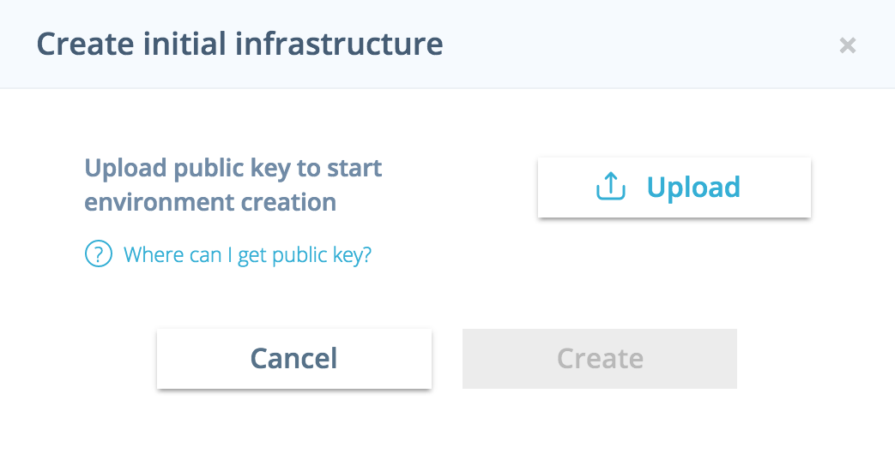
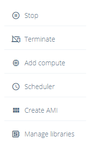

What is DLAB?
=============

DLab is an essential toolset for analytics. It is a self-service Web Console, used to create and manage exploratory environments. It allows teams to spin up analytical environments with best of breed open-source tools just with a single click of the mouse. Once established, environment can be managed by an analytical team itself, leveraging simple and easy-to-use Web Interface.

------------
## CONTENTS
-----------

[Login](#login)

[Setup a Gateway/Edge node](#setup_edge_node)

[Setting up analytical environment and managing computational power](#setup_environmen)

&nbsp; &nbsp; &nbsp; &nbsp; [Create notebook server](#notebook_create)

&nbsp; &nbsp; &nbsp; &nbsp; &nbsp; &nbsp; &nbsp; &nbsp; [Manage libraries](#manage_libraries)

&nbsp; &nbsp; &nbsp; &nbsp; [Stop Notebook server](#notebook_stop)

&nbsp; &nbsp; &nbsp; &nbsp; [Terminate Notebook server](#notebook_terminate)

&nbsp; &nbsp; &nbsp; &nbsp; [Deploy EMR](#emr_deploy)

&nbsp; &nbsp; &nbsp; &nbsp; [Terminate EMR](#emr_terminate)

&nbsp; &nbsp; &nbsp; &nbsp; [Collaboration space](#collaboration_space)

&nbsp; &nbsp; &nbsp; &nbsp; &nbsp; &nbsp; &nbsp; &nbsp; [Manage Git credentials](#git_creds)

&nbsp; &nbsp; &nbsp; &nbsp; &nbsp; &nbsp; &nbsp; &nbsp; [Git UI tool](#git_ui)

[DLab Health Status Page](#health_page)

[DLab billing report](#billing_page)

[Web UI filters](#filter)

---------
# Login 

As soon as DLab is deployed by an infrastructure provisioning team and you received DLab URL, your username and password – open DLab login page, fill in your credentials and hit Login.

DLab Web Application uses two-factor authentication algorithm. On login user name is validated against:

-   Open LDAP;
-   AWS IAM;

Make sure that corresponding user has been setup by administrator for each Data Scientist

| Login error messages               | Reason                                                                           |
|------------------------------------|----------------------------------------------------------------------------------|
| Username or password are not valid |The username provided: doesn’t match any LDAP user OR there is a type in the password field |
| Please contact AWS administrator to create corresponding IAM User | The user name provided: exists in LDAP BUT: doesn’t match any of IAM users in AWS |
| Please contact AWS administrator to activate your Access Key      | The username provided: exists in LDAP BUT: IAM user doesn’t have a single Access Key\* created OR IAM user’s Access Key is Inactive |

\* Please refer to official documentation from Amazon to figure out how to manage Access Keys for your AWS Account: http://docs.aws.amazon.com/general/latest/gr/managing-aws-access-keys.html

To stop working with DLab - click on Log Out link at the top right corner of DLab.

----------------------------------
# Setup a Gateway/Edge node 

When you log into DLab Web Application, the first thing you will have to setup is a Gateway Node, or an “Edge” Node.

To do this click on “Upload” button on “Create initial infrastructure”, select your personal public key and hit “Create” button.

Please note that you need to have a key pair combination (public and private key) to work with DLab. To figure out how to create public and private key, please click on “Where can I get public key?” on “Create initial infrastructure” dialog. DLab build-in wiki page will guide Windows, MasOS and Linux on how to generate SSH key pairs quickly.

After you hit Create button, creation of Edge node will start. This process is a one-time operation for each Data Scientist and it might take up-to 10 minutes for DLab to setup initial infrastructure for you. During this process, you will see following popup in your browser:

As soon as an Edge node is created, Data Scientist will see a blank “List of Resources” page. The message “To start working, please create new environment” will be displayed:

---------------------------------------------------------------------------------------
# Setting up analytical environment and managing computational power 

----------------------
## Create notebook server 

To create new analytical environment from “List of Resources” page click on Create new button.

“Create analytical tool” popup will show-up. Data Scientist can choose a preferable analytical tool to be setup. Adding new analytical tools is supported by architecture, so you can expect new templates to show up in upcoming releases.

Currently by means of DLab, Data Scientists can select between any of the following templates:

-   Jupyter
-   Zeppelin
-   RStudio
-   TensorFlow (Jupyter + TensorFlow)
-   Deep Learning (Jupyter + MXNet, Caffe, Caffe2, TensorFlow, Theano, CNTK, Torch and Keras)

After specifying desired template, you should fill in the “Name” and “Instance shape”.

Name field – is just for visual differentiation between analytical tools on “List of resources” dashboard.

Instance shape dropdown, contains configurable list of shapes, which should be chosen depending on the type of analytical work to be performed. Following groups of instance shapes will be showing up with default setup configuration:

These groups have T-Shirt based shapes (configurable), that can help Data Scientist to either save money\* and leverage not very powerful shapes (for working with relatively small datasets), or that could boost the performance of analytics by selecting more powerful instance shape.

\* Please refer to official documentation from Amazon that will help you understand what [instance shapes](https://aws.amazon.com/ec2/instance-types/) would be most preferable in your particular DLAB setup. Also, you can use [AWS calculator](https://calculator.s3.amazonaws.com/index.html) to roughly estimate the cost of your environment. *

After you Select the template, fill in the Name and choose needed instance shape - you need to click on Create button for your instance to start creating. Corresponding record will show up in your dashboard:

As soon as notebook server is created, its status will change to Running:

When you click on the name of your Analytical tool in the dashboard – analytical tool popup will show up:

In the header you will see version of analytical tool, its status and shape.

In the body of the dialog:

-   Up time
-   Analytical tool URL
-   Git UI tool (ungit)
-   S3 shared bucket for all users
-   S3 bucket that has been provisioned for your needs

To access analytical tool Web UI – you need to configure SOCKS proxy. Please follow the steps described on “Read instruction how to create the tunnel” page to configure SOCKS proxy for Windows/MAC/Linux machines.

### Manage libraries 

On every analytical tool instance you can install additional libraries by clicking on gear icon  in the Actions column for a needed Notebook and hit Manage libraries:

You need to wait for a while after clicking till list of all available libraries for chosen notebook will be received.

After downloading the list, you will see the window with 2 fields:
-   Field for selecting group of packages (apt/yum, Python 2, Python 3, R, Others)
-   Field for search available packages with autocomplete function

**Note:** apt or yum packages depends on your DLab OS family.

**Note:** In group Others you can find other Python (2/3) packages, which haven't classifiers of version.

After selecting library, you can see it on the right and could delete in from this list before installing.

After clicking on "Install" button you will see process of installation with appropriate status.

**Note:** If package can't be installed you will see "Failed" in status column and button to retry installation. If several packages have been failed to install, you will see button "Retry all".

--------------------------
## Stop Notebook server 

Once you have stopped working with an analytical tool and you would like to release AWS resources for the sake of the costs, you might want to Stop the notebook. You will be able to Start the notebook again after a while and proceed with your analytics.

To Stop the Notebook click on a gear icon  in the Actions column for a needed Notebook and hit Stop:

Hit OK in confirmation popup.

**NOTE:** if any EMR clusters have been connected to your notebook server – they will be automatically terminated if you stop the notebook.

After you confirm you intent to Stop the notebook - the status will be changed to Stopping and will become Stopped in a while. EMR cluster status will be changed to Terminated.

--------------------------------
## Terminate Notebook server 

Once you have finished working with an analytical tool and you would like to release AWS resources for the sake of the costs, you might want to Terminate the notebook. You will not be able to Start the notebook which has been Terminated. Instead, you will have to create new Notebook server if you will need to proceed your analytical activities.

To Terminate the Notebook click on a gear icon  in the Actions column for a needed Notebook and hit Terminate:

**NOTE:** if any EMR clusters have been linked to your notebook server – they will be automatically terminated if you stop the notebook.

Confirm termination of the notebook and afterward notebook status will be changed to **Terminating**:

Once corresponding instances are terminated on AWS, status will finally
change to Terminated:

---------------
## Deploy EMR 

After deploying Notebook node, you can deploy EMR cluster and it will be automatically linked with your Notebook server. EMR cluster is a managed cluster platform, that simplifies running big data frameworks, such as Apache Hadoop and Apache Spark on AWS to process and analyze vast amounts of data. Adding EMR is not mandatory and is needed in case computational resources are required for job execution.

On “Create Computational Resource” popup you will have to choose EMR version (configurable) and specify alias for EMR cluster. To setup a cluster that meets your needs – you will have to define:

-   Total number of instances (min 2 and max 14, configurable);
-   Master and Slave instance shapes (list is configurable and supports all available AWS instance shapes, supported in your AWS region);

Also, if you would like to save some costs for your EMR cluster you can create EMR cluster based on [spot instances](https://aws.amazon.com/ec2/spot/), which are often available at a discount price:

-   Select Spot Instance checkbox;
-   Specify preferable bid for your spot instance in % (between 20 and 90, configurable).

**NOTE:** When the current Spot price rises above your bid price, the Spot instance is reclaimed by AWS so that it can be given to another customer. Please make sure to backup your data on periodic basis.

If you click on Create button EMR cluster creation will kick off. You will see corresponding record on DLab Web UI in status **Creating**:

Once EMR clusters are provisioned, their status will be changed to **Running**.

Clicking on EMR name in DLab dashboard will open EMR details popup:

Since EMR cluster is up and running - you are now able to leverage cluster computational power to run your analytical jobs on.

To do that open any of the analytical tools and select proper kernel/interpreter:

**Jupyter** – goto Kernel and choose preferable interpreter between local and EMR ones. Currently we have added support of Python 2/3, Spark, Scala, R into Jupyter.

**Zeppelin** – goto Interpreter Biding menu and switch between local and EMR there. Once needed interpreter is selected click on Save.

Insert following “magics” before blocks of your code to start executing your analytical jobs:

-   interpreter\_name.%spark – for Scala and Spark;
-   interpreter\_name.%pyspark – for Python2;
-   interpreter\_name.%pyspark3 – for Python3;
-   interpreter\_name.%sparkr – for R;

**R-studio –** open R.environ and comment out /opt/spark/ to switch to EMR and vise versa to switch to local kernel:

------------------
## Terminate EMR 

To release cluster computational resources click on  button close to EMR cluser alias. Confirm decommissioning of EMR by hitting Yes:

In a while EMR cluster will get **Terminated**. Corresponding EC2 instances will also removed on AWS.

--------------------------------
## Collaboration space 

### Manage Git credentials 

To work with Git (pull, push) via UI tool (ungit) you could add multiple credentials in DLab UI, which will be setted on all running instances with analytical tools.

When you click on the button "Git credentials" in the dashboard – popup will show up:

In this window you need to add:
-   Your Git server hostname, without **http** or **https**, for example: gitlab.com, github.com, or you internal GitLab server, which can be deployed with DLab.
-   Your Username and Email - used for display author of commit in git.
-   Your Login and Password for authorization process to git server.

**Note:** If you have GitLab server, which was deployed with DLab, you should use your LDAP credentials for access to GitLab.

After filling all fields, and click on "Assign" button, you will see list with all your credentials for Git.

After clicking on button "Apply changes" your credentials will be sent to all running instances with analytical tools. It takes a few seconds.

Also in this tab you can edit your credentials (click on pen icon) or delete (click on bin icon).

### Git UI tool (ungit) 

On every analytical tool instance you can see Git UI tool (ungit):

Before start working with git repositories, you need to change working directory on the top of window to:

**/home/dlab-user/** or **/opt/zeppelin/notebook** for Zeppelin analytical tool and press enter.

After changing working directory you can create repository or better way - clone existing:

After creating repository you can see all commits and branches:

On the top of window in the red field UI show us changed or new files to commit. You can uncheck or add some files to gitignore.

**Note:** Git always check you credentials, and if this is your first commit after adding/changing credentials after clicking on "Commit" button nothing happend, you need click on this button again.

On the right pane of window you also can see buttons to fetch last changes of repository, add upstreams and changing branches.

All changes of files you can see clicking on the "circle" button on the center:

After commit you will see your local version and remote repository. To push you changes click on your current branch and press "Push" button.

Also clicking on "circle" button you can uncommit or revert changes.

--------------------------------
# DLab Health Status Page 

Health Status page is an administration page allowing users to start/stop/recreate gateway node. This might be useful in cases when someone manually deleted corresponding Edge node instance from AWS. This would have made DLab as an application corrupted in general. If any actions are manually done to Edge node EC2 instance directly via AWS Web Console – those changes will be synchronized with DLab automatically and shortly Edge Node status will be updated in DLab.

To access Health status page either navigate to it via main menu:

or by clicking on an icon close to logged in user name in the top right
corner of the DLab:

-   green , if Edge node status is Running;
-   red ,if Edge node is Stopped or Terminated;

To Stop Edge Node please click on actions icon on Health Status page and hit Stop.

Confirm you want to stop Edge node by clicking Yes:

In case you Edge node is Stopped or Terminated – you will have to Start or Recreate it correspondingly to proceed working with DLab. This can done as well via context actions menu.

--------------------------------
# DLab billing report 

On this page you can see all billing, which contains all costs applies to service base name of SSN.

On the header you can see 3 fields:
-   Service base name of your environment
-   Resource tag ID
-   Date period of available billing report

On the center of header you can choose period of report in datepicker:

On the header you also can filter data by every column:

**Note:** Administrator can see billing report of all users environments including own one, and only he can see/filter "User" column.

On the right bottom corner you can see Total cost for all environments.

--------------------
# Web UI filters 

You can leverage functionality of build-in UI filter to quickly manage the analytical tools and EMR clusters, which you only want to see in your dashboard.

To do this, simply click on icon  in dashboard header and filter your list by any of:

-   environment name (input field);
-   status (multiple choice);
-   shape (multiple choice);
-   computational resources (multiple choice);

Once your list of filtered by any of the columns, icon  changes to
 for a filtered columns only.

There is also an option for quick and easy way to filter out all inactive instances (Failed and Terminated) by clicking on “Show active” button in the ribbon. To switch back to the list of all resources, click on “Show all”.
