What is DLAB?
=============

DLab is an essential toolset for analytics. It is a self-service Web Console, used to create and manage exploratory environments. It allows teams to spin up analytical environments with best of breed open-source tools just with a single click of the mouse. Once established, environment can be managed by an analytical team itself, leveraging simple and easy-to-use Web Interface.

See more at <a href="http://dlab.opensource.epam.com/" rel="nofollow">dlab.opensource.epam.com</a>.

------------
## CONTENTS
-----------

[Login](#login)

[Setup a Gateway/Edge node](#setup_edge_node)

[Setting up analytical environment and managing computational power](#setup_environmen)

&nbsp; &nbsp; &nbsp; &nbsp; [Create notebook server](#notebook_create)

&nbsp; &nbsp; &nbsp; &nbsp; &nbsp; &nbsp; &nbsp; &nbsp; [Manage libraries](#manage_libraries)

&nbsp; &nbsp; &nbsp; &nbsp; [Stop Notebook server](#notebook_stop)

&nbsp; &nbsp; &nbsp; &nbsp; [Terminate Notebook server](#notebook_terminate)

&nbsp; &nbsp; &nbsp; &nbsp; [Deploy Computational resource](#computational_deploy)

&nbsp; &nbsp; &nbsp; &nbsp; [Stop Apache Spark cluster](#spark_stop)

&nbsp; &nbsp; &nbsp; &nbsp; [Terminate Computational resource](#computational_terminate)

&nbsp; &nbsp; &nbsp; &nbsp; [Collaboration space](#collaboration_space)

&nbsp; &nbsp; &nbsp; &nbsp; &nbsp; &nbsp; &nbsp; &nbsp; [Manage Git credentials](#git_creds)

&nbsp; &nbsp; &nbsp; &nbsp; &nbsp; &nbsp; &nbsp; &nbsp; [Git UI tool (ungit)](#git_ui)

[DLab Health Status Page](#health_page)

[DLab billing report](#billing_page)

[DLab Environment Management Page](#environment_management)

[Web UI filters](#filter)

[Scheduler](#scheduler)

[Key reupload](#key_reupload)

---------
# Login 

As soon as DLab is deployed by an infrastructure provisioning team and you received DLab URL, your username and password – open DLab login page, fill in your credentials and hit Login.

DLab Web Application authenticates users against:

-   OpenLdap;
-   Cloud Identity and Access Management service user validation;

| Login error messages               | Reason                                                                           |
|------------------------------------|----------------------------------------------------------------------------------|
| Username or password are not valid |The username provided: doesn’t match any LDAP user OR there is a type in the password field |
| Please contact AWS administrator to create corresponding IAM User | The user name provided: exists in LDAP BUT: doesn’t match any of IAM users in AWS |
| Please contact AWS administrator to activate your Access Key      | The username provided: exists in LDAP BUT: IAM user doesn’t have a single Access Key\* created OR IAM user’s Access Key is Inactive |

\* Please refer to official documentation from Amazon to figure out how to manage Access Keys for your AWS Account: http://docs.aws.amazon.com/general/latest/gr/managing-aws-access-keys.html

To stop working with DLab - click on Log Out link at the top right corner of DLab.

----------------------------------
# Setup a Gateway/Edge node 

When you log into DLab Web Application, the first thing you will have to setup is a Gateway Node, or an “Edge” Node.

To do this click on “Upload” button on “Create initial infrastructure”, select your personal public key and hit “Create” button or click on "Generate" button on “Create initial infrastructure” and save your private key.

 
    

Please note that you need to have a key pair combination (public and private key) to work with DLab. To figure out how to create public and private key, please click on “Where can I get public key?” on “Create initial infrastructure” dialog. DLab build-in wiki page will guide Windows, MasOS and Linux on how to generate SSH key pairs quickly.

After you hit Create or Generate button, creation of Edge node will start. This process is a one-time operation for each Data Scientist and it might take up-to 10 minutes for DLab to setup initial infrastructure for you. During this process, you will see following popup in your browser:

 
    

As soon as an Edge node is created, Data Scientist will see a blank “List of Resources” page. The message “To start working, please create new environment” will be displayed:

---------------------------------------------------------------------------------------
# Setting up analytical environment and managing computational power 

----------------------
## Create notebook server 

To create new analytical environment from “List of Resources” page click on Create new button.

“Create analytical tool” popup will show-up. Data Scientist can choose a preferable analytical tool to be setup. Adding new analytical tools is supported by architecture, so you can expect new templates to show up in upcoming releases.

Currently by means of DLab, Data Scientists can select between any of the following templates:

-   Jupyter
-   Apache Zeppelin
-   RStudio
-   TensorFlow (Jupyter + TensorFlow)
-   Deep Learning (Jupyter + MXNet, Caffe, Caffe2, TensorFlow, CNTK, Theano, Torch and Keras)

**Note:** terms 'Apache Zeppelin' and 'Apache Spark' hereinafter may be referred to as 'Zeppelin' and 'Spark' respectively or may have original reference.

 
    

After specifying desired template, you should fill in the “Name” and “Instance shape”.

Name field – is just for visual differentiation between analytical tools on “List of resources” dashboard.

Instance shape dropdown, contains configurable list of shapes, which should be chosen depending on the type of analytical work to be performed. Following groups of instance shapes will be showing up with default setup configuration:

 
    

These groups have T-Shirt based shapes (configurable), that can help Data Scientist to either save money\* and leverage not very powerful shapes (for working with relatively small datasets), or that could boost the performance of analytics by selecting more powerful instance shape.

\* Please refer to official documentation from Amazon that will help you understand what [instance shapes](https://aws.amazon.com/ec2/instance-types/) would be most preferable in your particular DLAB setup. Also, you can use [AWS calculator](https://calculator.s3.amazonaws.com/index.html) to roughly estimate the cost of your environment.

After you Select the template, fill in the Name and choose needed instance shape - you need to click on Create button for your instance to start creating. Corresponding record will show up in your dashboard:

As soon as notebook server is created, its status will change to Running:

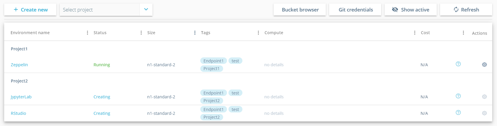

When you click on the name of your Analytical tool in the dashboard – analytical tool popup will show up:

 
    

In the header you will see version of analytical tool, its status and shape.

In the body of the dialog:

-   Up time
-   Analytical tool URL
-   Git UI tool (ungit)
-   Shared bucket for all users
-   Bucket that has been provisioned for your needs

To access analytical tool Web UI – you need to configure SOCKS proxy. Please follow the steps described on “Read instruction how to create the tunnel” page to configure SOCKS proxy for Windows/MAC/Linux machines.

### Manage libraries 

On every analytical tool instance you can install additional libraries by clicking on gear icon  in the Actions column for a needed Notebook and hit Manage libraries:

 
    

After clicking you will see the window with 3 fields:
-   Field for selecting an active resource to install libraries on
-   Field for selecting group of packages (apt/yum, Python 2, Python 3, R, Others)
-   Field for search available packages with autocomplete function

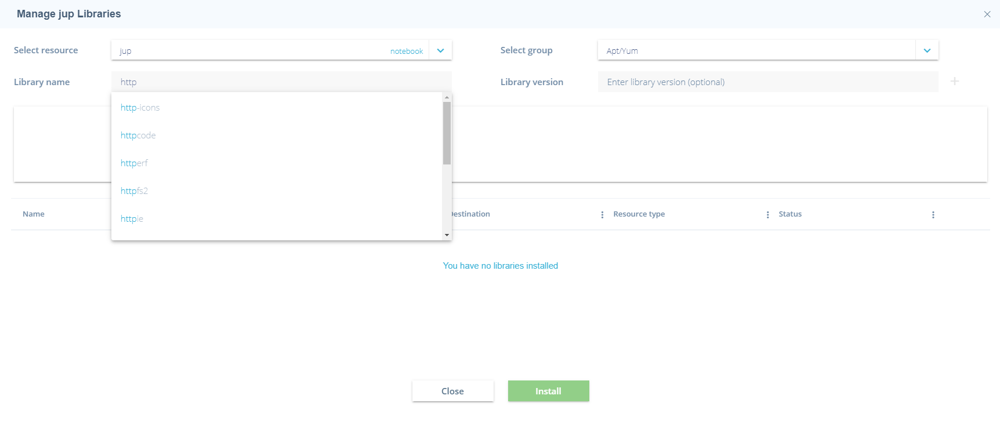

You need to wait for a while after resource choosing till list of all available libraries will be received.

**Note:** apt or yum packages depends on your DLab OS family.

**Note:** In group Others you can find other Python (2/3) packages, which haven't classifiers of version.

After selecting library, you can see it on the right and could delete in from this list before installing.

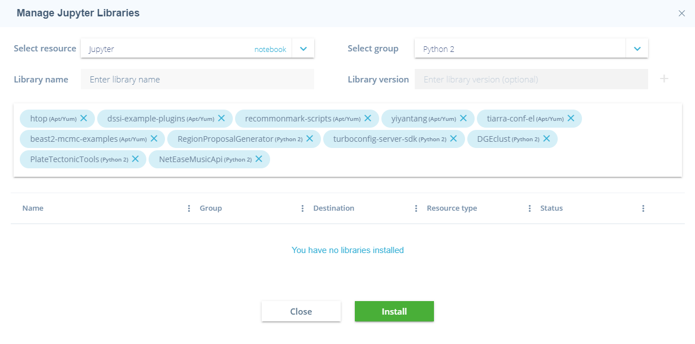

After clicking on "Install" button you will see process of installation with appropriate status.

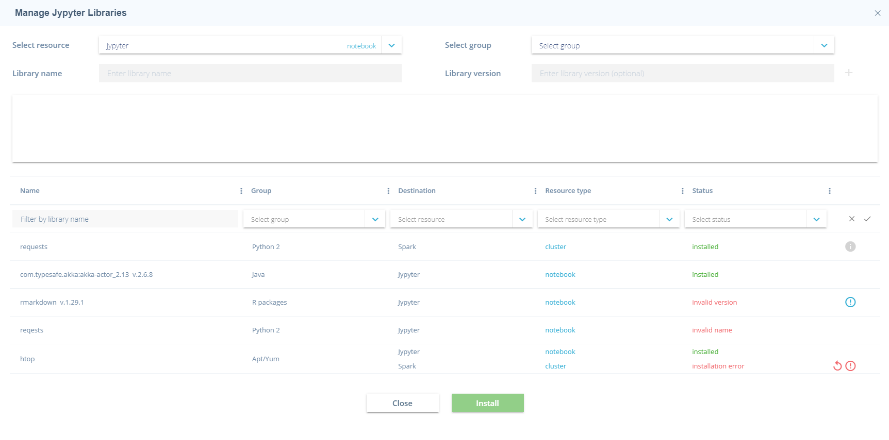

**Note:** If package can't be installed you will see "Failed" in status column and button to retry installation.

--------------------------
## Stop Notebook server 

Once you have stopped working with an analytical tool and you would like to release cloud resources for the sake of the costs, you might want to Stop the notebook. You will be able to Start the notebook again after a while and proceed with your analytics.

To Stop the Notebook click on a gear icon  in the Actions column for a needed Notebook and hit Stop:

 
    

Hit OK in confirmation popup.

**NOTE:** if any Computational resources except for Spark cluster have been connected to your notebook server – they will be automatically terminated if you stop the notebook and Spark cluster will be automatically stopped.

 
    

After you confirm you intent to Stop the notebook - the status will be changed to Stopping and will become Stopped in a while. Spark cluster status will be changed to Stopped and other Computational resource status  will be changed to Terminated.

--------------------------------
## Terminate Notebook server 

Once you have finished working with an analytical tool and you would like to release cloud resources for the sake of the costs, you might want to Terminate the notebook. You will not be able to Start the notebook which has been Terminated. Instead, you will have to create new Notebook server if you will need to proceed your analytical activities.

To Terminate the Notebook click on a gear icon  in the Actions column for a needed Notebook and hit Terminate:

**NOTE:** if any Computational resources have been linked to your notebook server – they will be automatically terminated if you stop the notebook.

Confirm termination of the notebook and afterward notebook status will be changed to **Terminating**:

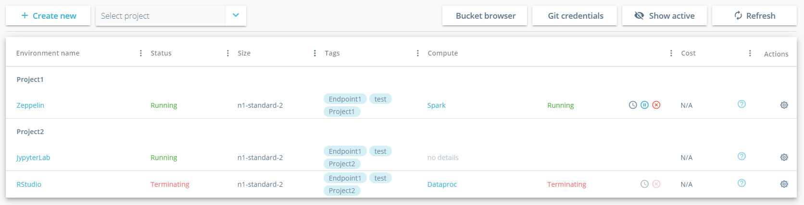

Once corresponding instances are terminated on cloud, status will finally
change to Terminated:

---------------
## Deploy Computational resource 

After deploying Notebook node, you can deploy Computational resource and it will be automatically linked with your Notebook server. Computational resource is a managed cluster platform, that simplifies running big data frameworks, such as Apache Hadoop and Apache Spark on cloud to process and analyze vast amounts of data. Adding Computational resource is not mandatory and is needed in case computational resources are required for job execution.

On “Create Computational Resource” popup you will have to choose Computational resource version (configurable) and specify alias for it. To setup a cluster that meets your needs – you will have to define:

-   Total number of instances (min 2 and max 14, configurable);
-   Master and Slave instance shapes (list is configurable and supports all available cloud instance shapes, supported in your cloud region);

Also, if you would like to save some costs for your Computational resource you can create it based on [spot instances](https://aws.amazon.com/ec2/spot/), which are often available at a discount price (this functionality is only available for AWS cloud):

-   Select Spot Instance checkbox;
-   Specify preferable bid for your spot instance in % (between 20 and 90, configurable).

**NOTE:** When the current Spot price rises above your bid price, the Spot instance is reclaimed by cloud so that it can be given to another customer. Please make sure to backup your data on periodic basis.

This picture shows menu for creating Computational resource for AWS:

 
    

This picture shows menu for creating Computational resource for Azure:

 
    

If you click on Create button Computational resource creation will kick off. You will see corresponding record on DLab Web UI in status **Creating**:

Once Computational resources are provisioned, their status will be changed to **Running**.

Clicking on Computational resource name in DLab dashboard will open Computational resource details popup:

 
    

Since Computational resource is up and running - you are now able to leverage cluster computational power to run your analytical jobs on.

To do that open any of the analytical tools and select proper kernel/interpreter:

**Jupyter** – goto Kernel and choose preferable interpreter between local and Computational resource ones. Currently we have added support of Python 2/3, Spark, Scala, R into Jupyter.

**Zeppelin** – goto Interpreter Biding menu and switch between local and Computational resource there. Once needed interpreter is selected click on Save.

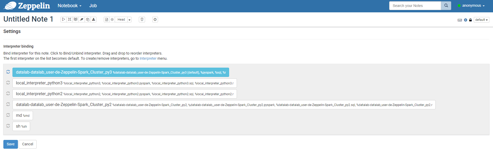

Insert following “magics” before blocks of your code to start executing your analytical jobs:

-   interpreter\_name.%spark – for Scala and Spark;
-   interpreter\_name.%pyspark – for Python2;
-   interpreter\_name.%pyspark3 – for Python3;
-   interpreter\_name.%sparkr – for R;

**RStudio –** open R.environ and comment out /opt/spark/ to switch to Computational resource and vise versa to switch to local kernel:

---------------
## Stop Spark cluster 

Once you have stopped working with a spark cluster and you would like to release cloud resources for the sake of the costs, you might want to Stop the spark cluster. You will be able to Start the spark cluster again after a while and proceed with your analytics.

To Stop the spark cluster click on  button close to spark cluster alias.

Hit YES in confirmation popup.

 
    

After you confirm your intent to Stop the spark cluster - the status will be changed to Stopping and will become Stopped in a while.

------------------
## Terminate Computational resource 

To release cluster computational resources click on  button close to Computational resource alias. Confirm decommissioning of Computational resource by hitting Yes:

 
    

In a while Computational resource cluster will get **Terminated**. Corresponding cloud instances will also removed on cloud.

--------------------------------
## Collaboration space 

### Manage Git credentials 

To work with Git (pull, push) via UI tool (ungit) you could add multiple credentials in DLab UI, which will be set on all running instances with analytical tools.

When you click on the button "Git credentials" – following popup will show up:

 
    

In this window you need to add:
-   Your Git server hostname, without **http** or **https**, for example: gitlab.com, github.com, or your internal GitLab server, which can be deployed with DLab.
-   Your Username and Email - used to display author of commit in git.
-   Your Login and Password - for authorization into git server.

**Note:** If you have GitLab server, which was deployed with DLab, you should use your LDAP credentials for access to GitLab.

Once all fields are filled in and you click on "Assign" button, you will see the list of all your Git credentials.

Clicking on "Apply changes" button, your credentials will be sent to all running instances with analytical tools. It takes a few seconds for changes to be applied.

 
    

On this tab you can also edit your credentials (click on pen icon) or delete (click on bin icon).

### Git UI tool (ungit) 

On every analytical tool instance you can see Git UI tool (ungit):

 
    

Before start working with git repositories, you need to change working directory on the top of window to:

**/home/dlab-user/** or **/opt/zeppelin/notebook** for Zeppelin analytical tool and press Enter.

**Note:** Zeppelin already uses git for local versioning of files, you can add upstream for all notebooks.

After changing working directory you can create repository or better way - clone existing:

After creating repository you can see all commits and branches:

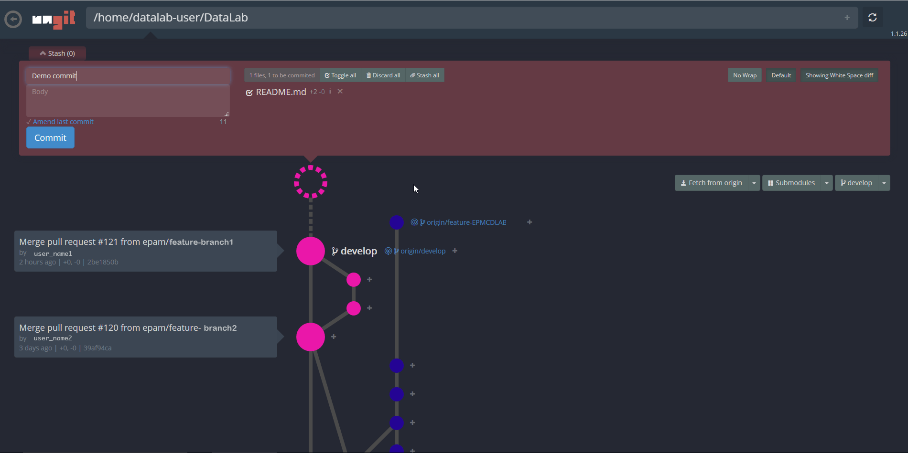

On the top of window in the red field UI show us changed or new files to commit. You can uncheck or add some files to gitignore.

**Note:** Git always checks you credentials. If this is your first commit after adding/changing credentials and after clicking on "Commit" button nothing happened - just click on Commit button again.

On the right pane of window you also can see buttons to fetch last changes of repository, add upstreams and switch between branches.

To see all modified files - click on the "circle" button on the center:

After commit you will see your local version and remote repository. To push you changes - click on your current branch and press "Push" button.

Also clicking on "circle" button you can uncommit or revert changes.

--------------------------------
# DLab Health Status Page 

Health Status page is an administration page allowing users to start/stop/recreate gateway node. This might be useful in cases when someone manually deleted corresponding Edge node instance from cloud. This would have made DLab as an application corrupted in general. If any actions are manually done to Edge node instance directly via Cloud Web Console – those changes will be synchronized with DLab automatically and shortly Edge Node status will be updated in DLab.

To access Health status page either navigate to it via main menu:

 
    

or by clicking on an icon close to logged in user name in the top right
corner of the DLab:

-   green , if Edge node status is Running;
-   red ,if Edge node is Stopped or Terminated;

To Stop Edge Node please click on actions icon on Health Status page and hit Stop.

 
    

Confirm you want to stop Edge node by clicking Yes:

 
    

In case you Edge node is Stopped or Terminated – you will have to Start or Recreate it correspondingly to proceed working with DLab. This can done as well via context actions menu.

Administrator can use backup functionality. In order to do it click Backup button. "Backup options" popup will show-up. You can choose a preferable option to be backed up.

 
    

Confirm you want to do backup by clicking Apply.

Administrator can manage users environment clicking on Manage environment button. "Manage environment" popup will show-up. All users environments will be shown which at least one instance has Running status:

 
    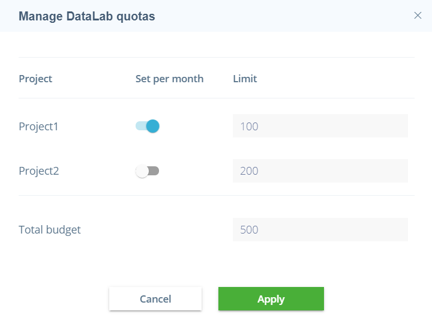

If Administrator hit Stop button all running instances except for dataengine service will be stopped and dataengine service will be terminated. User will be able to Start instances again except for dataengine service after a while and proceed with his analytics.

If Administrator hit Terminate button all running and stopped instances will be terminated. User will not be able to Start the inctance which has been Terminated. Instead, user will have to Upload his personal public key or Generate ssh key pairs.

Administrator should confirm user environment stopping or termination by clicking Yes:

 
    

--------------------------------
# DLab Billing report 

On this page you can see all billing information, including all costs assosiated with service base name of SSN.

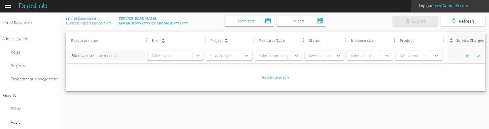

In the header you can see 3 fields:
-   Service base name of your environment
-   Resource tag ID
-   Date period of available billing report

On the center of header you can choose period of report in datepicker:

 
    

You can save billing report in csv format hitting Export button.

You can also filter data by each column:

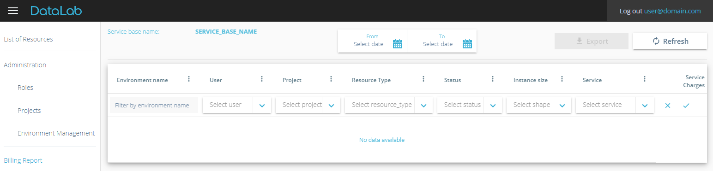

**Note:** Administrator can see billing report of all users, and only he can see/filter "User" column.

In the footer of billing report, you can see Total cost for all environments.

--------------------------------
# DLab Environment Management Page 

DLab Environment Management page is an administration page allowing admins to show the list of all users` environments and to stop/terminate all of them of separate specific resource.

To access Environment management page either navigate to it via main menu:

 
    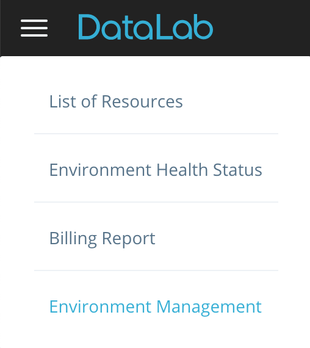

 
    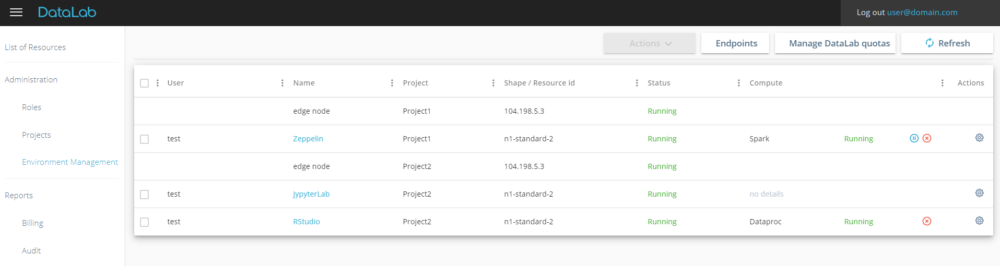

To Stop or Terminate the Notebook click on a gear icon gear in the Actions column for a needed Notebook and hit Stop or Terminate action:

 
    

Any Computational resources except for Spark clusters will be automatically terminated and Spark clusters will be stopped in case of Stop action hitting, and all resources will be killed in case of Terminate action hitting.

To stop or release specific cluster click an appropriate button close to cluster alias.

 
    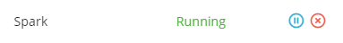

Confirm stopping/decommissioning of the Computational resource by hitting Yes:

 
    

**NOTE:** terminate action is available only for notebooks and computational resources, not for Edge Nodes.

--------------------------------

# Web UI filters 

You can leverage functionality of build-in UI filter to quickly manage the analytical tools and computational resources, which you only want to see in your dashboard.

To do this, simply click on icon  in dashboard header and filter your list by any of:

-   environment name (input field);
-   status (multiple choice);
-   shape (multiple choice);
-   computational resources (multiple choice);

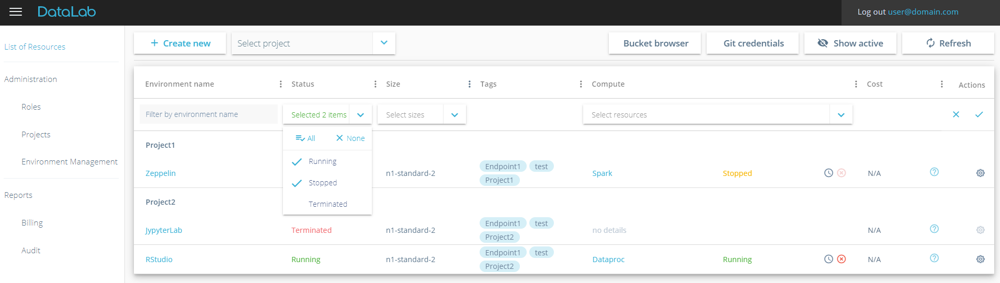

Once your list of filtered by any of the columns, icon  changes to
 for a filtered columns only.

There is also an option for quick and easy way to filter out all inactive instances (Failed and Terminated) by clicking on “Show active” button in the ribbon. To switch back to the list of all resources, click on “Show all”.

# Scheduler 

Scheduler component allows to automatically schedule start/stop of notebook/cluster. There are 2 types of schedulers available:
- notebook scheduler;
- data engine scheduler (currently spark cluster only);

To create scheduler for a notebook click on a  icon in the Actions column for a needed Notebook and hit Scheduler:

 
    

After clicking you will see popup with the following fields:

- start/finish dates - date range when scheduler is active;
- start/end time - time when notebook should be running;
- offset - your zone offset;
- repeat on - days when scheduler should be active
- possibility to synchronize notebook scheduler with computational schedulers

 
    

Also scheduler can be configured for a spark cluster. To configure scheduler for spark cluster  should be clicked (near computational status):

 
    

There is a possibility to inherit scheduler start settings from notebook, if such scheduler is present:

 
    

Once any scheduler is set up, notebook/spark cluster will be started/stopped automatically.
Please also note that if notebook is configured to be stopped, all running data engines assosiated with it will be stopped (for spark cluster) or terminated (for data engine serice) with notebook.

# Key reupload 
In case when user private key was corrupted, lost etc. DLAB provide a possibility to reupload user public key.
It can be done on manage environment page using ACTIONS menu on edge instance:

 
    

After that similar to create initial environment dialog appeared where you can upload new key or generate new key-pair:
 
 
 
     
 

